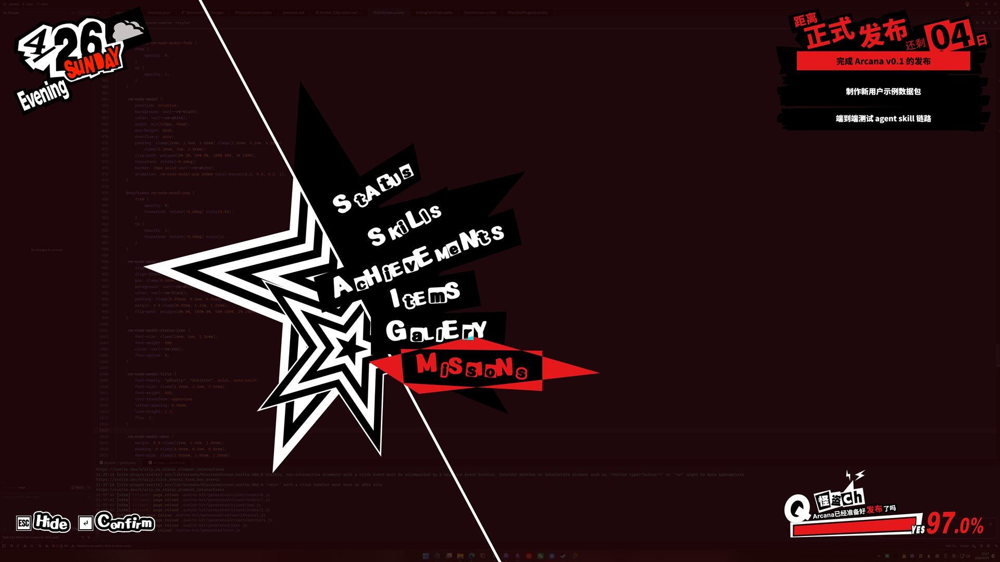
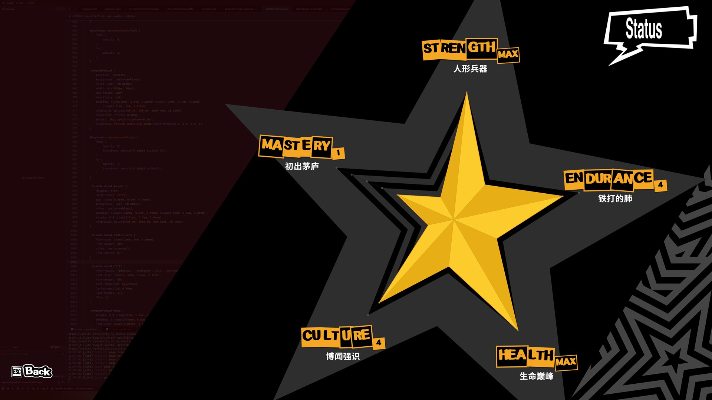
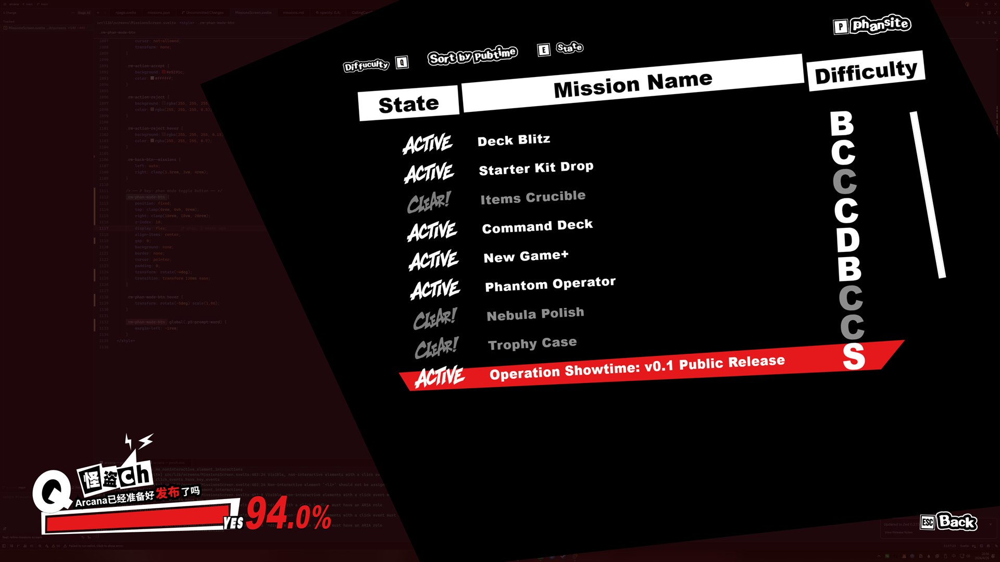
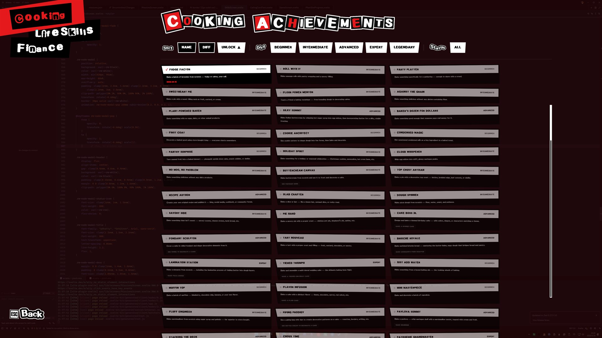
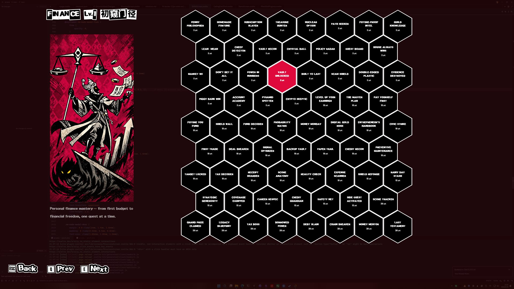
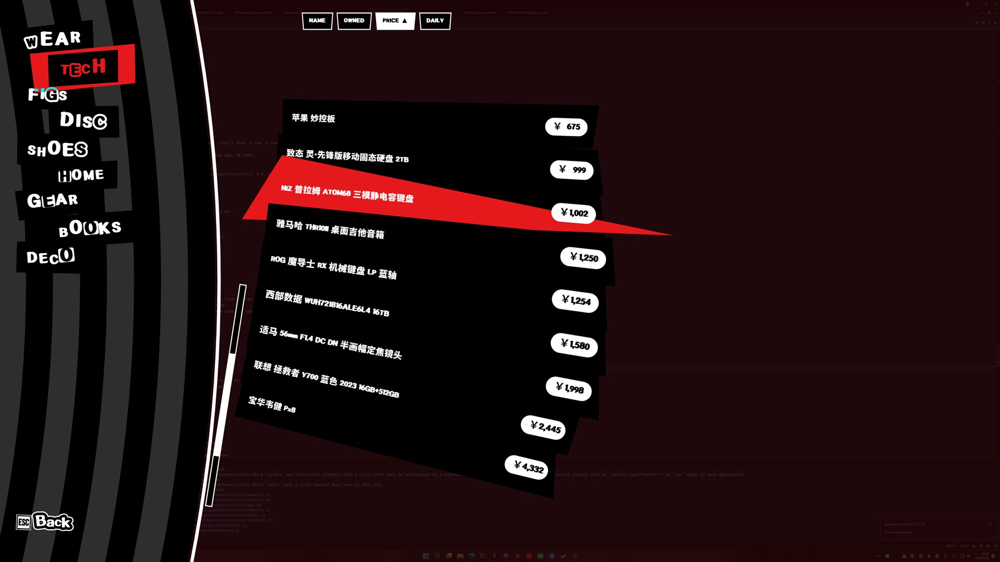

# Arcana

[English](README.md) | [简体中文](README.zh-CN.md)

An AI-guided, Persona 5-inspired HUD for gamified life management.

> [!IMPORTANT]
> Arcana is designed to work best as an AI-assisted life management tool: the AI agent helps interpret updates, propose missions, and keep local JSON data coherent. For the intended visual experience, install the required fonts locally from legitimate sources; font files are not bundled with this repository or release builds. See [Font Requirements](#font-requirements).

---

## Project Overview

Arcana is an AI-guided desktop HUD for turning real-life progress into structured game-like systems: status dimensions, missions, achievements, skills, inventory, and media history. It stores your data locally as JSON and uses an AI agent to help interpret updates, propose missions, track progress, and keep the system coherent over time.

Arcana is **not** a streak-based habit tracker or a toy stat sheet. It borrows the visual language and motivation loops of games, but the underlying data is real: personal milestones, ongoing goals, owned items, consumed media, and measurable status signals. The goal is not to pretend life is a game, but to give real life a sharper interface.

---

## Screenshots

| Main Menu |
|-----------|
|  |

<table>
  <tr>
    <th width="50%">Status</th>
    <th width="50%">Missions</th>
  </tr>
  <tr>
    <td></td>
    <td></td>
  </tr>
  <tr>
    <th width="50%">Achievements</th>
    <th width="50%">Skills</th>
  </tr>
  <tr>
    <td></td>
    <td></td>
  </tr>
  <tr>
    <th width="50%">Items</th>
    <th width="50%">Gallery</th>
  </tr>
  <tr>
    <td></td>
    <td></td>
  </tr>
</table>

---

## Features

### Status

Multi-dimensional life radar computed from real metrics.

- Status uses a three-layer model: raw **metrics**, scored **dimensions**, and Persona-style **level titles**.
- Dimension scores are calculated from weighted metric contributions, targets, ranges, or scoring brackets.
- System metrics (`sys_` prefix) are derived automatically from other modules, such as gallery counts, skill levels, achievement stats, BMI, and game days.
- Radar chart overview with drill-down into each dimension's contributing metrics.

### Achievements

Milestone tracking with content pack support.

- Record life milestones with unlock timestamps and difficulty grades (`beginner` through `legendary`).
- Achievements can have prerequisites, forming validated DAGs of dependencies.
- Content packs load achievement sets tailored to different interests, disciplines, and life domains.
- Pack navigation, difficulty filters, unlock sorting, and locked/unlocked visual states.
- AI agent can track partial progress, append progress notes, and mark completions.

### Skills

Honeycomb-style skill progression tightly coupled with achievements.

- Each skill node maps to an achievement; unlocking achievements lights up the corresponding tree nodes.
- Skill levels are computed from accumulated node points and required key achievements.
- Interactive skill overview and honeycomb node map with achievement details, prerequisite status, and progress history.
- Loaded via content packs alongside achievements, so new packs can add both milestones and skill progression.

### Missions

AI-driven quest system for current goals and next actions.

- Missions are proposed by the AI agent based on current goals and context, styled as Persona 5 "Phan-Site" requests.
- Lifecycle: `proposed` → `active` → `completed` / `archived` / `rejected`.
- AI-maintained 0–100 progress, deadlines, and completion timestamps.
- Main menu integration for countdowns, progress prompts, and rotating mission hints.
- Missions can link to achievements for cross-system progression.

### Items

Personal inventory with cost-over-time awareness.

- Track clothing, shoes, electronics, furniture, books, collectibles, and other possessions.
- Record purchase dates, prices, purchase channels, categories, images, and notes from local item files.
- Sort and compare by name, days owned, purchase price, and daily cost.
- Category summaries and item detail views turn ownership into a more mindful data surface.

### Gallery

Aggregated media consumption and play history hub.

- Unified view of anime, games, TV, movies, and books.
- Waterfall cover wall with category filters, rating/date/playtime sorting, and detail views.
- Tracks community ratings, personal ratings, tags, dates, episodes, playtime, and Steam achievement metadata where available.
- Import scripts for external sources:
  - Bangumi (anime)
  - Steam (games)
  - Douban (movies/TV/books)

---

## AI Agent

Arcana includes a built-in AI agent that acts as a personal life assistant, operating through three channels:

| Channel | Description |
|---------|-------------|
| **CLI** | Standalone terminal agent (`agent-cli`) |
| **Telegram** | Bot adapter for mobile access (`agent-telegram`) |
| **Data CLI** | Structured data operations for AI skills (`arcana-data`) |

All three share a common services layer (`src-tauri/src/services/`) and data format, so updates from any channel are immediately visible everywhere.

The agent can:
- Read current status, missions, achievements, and memory context
- Update mission progress and status
- Track and mark achievements
- Propose new missions based on your goals
- Maintain cross-session memory for continuity

---

## Tech Stack

- **Framework**: [Tauri v2](https://v2.tauri.app/) (Rust backend + webview frontend)
- **Frontend**: Svelte 5 + SvelteKit v2 + TypeScript + Tailwind CSS v4 + Three.js
- **Backend**: Rust (IPC commands, AI agent, JSON data layer)
- **Data**: Local JSON files (`data/`, gitignored) — no database
- **AI**: Direct Anthropic API integration with tool-calling loop

---

## Project Structure

```
src/                    # SvelteKit frontend
  ├── routes/           #   Single-page app (main menu + sub-screens)
  └── lib/
      ├── screens/      #   Screen components (Status, Achievements, Skills, Items, Gallery, Missions)
      ├── components/   #   Shared UI components (RadarChart, SkillNebula, etc.)
      ├── types/        #   TypeScript type definitions
      ├── stores/       #   Svelte stores
      └── utils/        #   Frontend utilities
src-tauri/src/          # Rust backend
  ├── commands/         #   Tauri IPC commands (status, achievements, skills, missions, items, gallery, weather)
  ├── models/           #   Serde data structures
  ├── storage/          #   JSON read/write & validation
  ├── services/         #   Shared business logic (used by agent, arcana-data CLI, and Tauri commands)
  ├── agent/            #   AI agent subsystem (runner, LLM, tools, prompt, config, session)
  └── bin/              #   Standalone binaries: agent_cli, agent_telegram, arcana_data
data/                   # Runtime JSON data (gitignored)
  ├── packs/<pack_id>/  #   Content packs (manifest.json, achievements.json, skills.json)
  ├── sessions/         #   Agent JSONL session history
  └── *.json            #   missions, status, achievement_progress, mission_memory, etc.
docs/                   # Architecture docs, schema specs, UI design guides
  └── schema/           #   JSON schema definitions
scripts/                # Python tooling (data import, schema validation)
static/                 # Static assets (icons, images)
```

---

## Quick Start

```bash
# 1. Install dependencies
npm install

# 2. Build the data CLI
cargo build --manifest-path src-tauri/Cargo.toml --bin arcana-data

# 3. Initialize your data directory (interactive — asks for username and birth date)
./src-tauri/target/debug/arcana-data init

# 4. Configure your AI provider (recommended: DeepSeek V4)
#    Create ~/.arcana/agent_config.json, for example:
#    { "api_key": "your-key", "base_url": "https://api.deepseek.com", "model": "deepseek-model-name" }

# 5. Run the app
npm run tauri dev
```

After the app opens, the onboarding missions will already be active in the Missions screen. Run `/velvet-room` in any AI coding agent that supports slash commands (Claude Code, OpenCode, Codex, or even openclaw (untested)) to let the AI guide you through the rest of the setup.

---

## Getting Started

### Prerequisites

- **Rust**: stable toolchain
- **Node.js**: v18+
- **Platform**: Windows / macOS / Linux

### Font Requirements

Arcana's visual style depends on a few system fonts. These font files are **not bundled with this repository or release builds**; users need to install them locally for the intended Persona 5-inspired look:

- `p5hatty` — primary display font for menus, labels, cards, and collage-style text
- `Source Han Sans SC` — Chinese UI and card-title text
- `Bebas Neue` — key hint badges

If these fonts are missing, the app will still run, but the UI will fall back to system fonts such as `Arial`, `Microsoft YaHei`, or generic `sans-serif`, and some title/card layouts may look different.

### Development

```bash
# Install frontend dependencies
npm install

# Run full desktop app in dev mode
npm run tauri dev

# Or run only the frontend dev server
npm run dev
```

### Build

```bash
# Build desktop release
npm run tauri build

# Build standalone agent binaries
cargo build --manifest-path src-tauri/Cargo.toml --bin agent-cli
cargo build --manifest-path src-tauri/Cargo.toml --bin agent-telegram
cargo build --manifest-path src-tauri/Cargo.toml --bin arcana-data
```

### Checks

```bash
# TypeScript / Svelte type checking
npm run check

# Rust tests
cargo test --manifest-path src-tauri/Cargo.toml

# Rust formatting
cargo fmt --manifest-path src-tauri/Cargo.toml --check
```

---

## Tooling Scripts

Arcana includes Python scripts for importing personal data, generating content packs, processing UI assets, and validating local JSON files.

Some data import scripts read credentials or user IDs from `scripts/config.json`. Use `scripts/config.example.json` as the template and keep real values local.

| Script | Purpose |
|--------|---------|
| `scripts/fetch_bangumi.py` | Fetch watched anime from Bangumi and write Gallery data. |
| `scripts/fetch_steam.py` | Fetch owned Steam games; `--detailed` also fetches achievements and store metadata. |
| `scripts/fetch_douban.py` | Fetch Douban movies, TV, and books; supports `--status all`. |
| `scripts/dev/process_assets.py` | Resize and prepare UI assets under `static/ui/`. |
| `scripts/dev/remove_bg.py` | Remove backgrounds from image files or folders. |
| `scripts/validate_data.py` | Validate runtime JSON data and content pack schema rules. |

```bash
python scripts/fetch_bangumi.py
python scripts/fetch_steam.py --detailed
python scripts/fetch_douban.py --status all
python scripts/validate_data.py data/missions.json
```

---

## Documentation

- [Architecture](docs/architecture.md) — Tauri, data layer, frontend, and agent architecture.
- [Directory Structure](docs/directory_structure.md) — project layout and historical structure notes.
- [Schema Reference](docs/schema/README.md) — detailed JSON schemas for missions, achievements, skills, status, items, gallery, changelog, memory, and UI events.
- [Visual Style Guide](docs/visual_style_guide.md) — Persona 5-inspired design principles, palette, typography, and interaction rules.
- [UI Design Spec](docs/ui_design_spec.md) — main menu and sub-screen layout/interaction spec.
- [AI Agent Integration](docs/ai_agent_integration.md) — MCP/Nanobot integration proposal and agent platform research notes.

---

## Design Decisions

- **Tauri + JSON over Electron + SQLite**: Smaller binary, better performance, human-readable and version-controllable data files.
- **Content Pack system**: Achievements and skills are loaded via pluggable packs, supporting community extension.
- **Agent decoupled from UI**: The AI agent runs independently of the desktop GUI (CLI / Telegram), sharing the same data layer.
- **Prerequisite-driven progression**: Achievement prerequisites remain a validated DAG in the data model, while skills present that progression as a compact honeycomb-style node map rather than a traditional edge graph.
- **Shared services layer**: `services/` contains all business logic, consumed by Tauri commands, arcana-data CLI, and the Rust agent alike.

---

## Roadmap to v0.1.0

- [ ] Provide example data configuration
- [x] Polish main menu — countdown and progress bar widgets
- [x] Polish Skills screen
- [x] Polish Achievements screen
- [x] Polish Items screen
- [x] Polish Gallery screen
- [x] Polish Missions screen
- [ ] Test agent skills functionality

---

## Future Ideas

### UI & Experience

- Onboarding wizard for first-time setup
- Sound effects across the interface
- Data-change reveal animations — show what changed since last session on first open
- Cinematic animations for mission acceptance and completion

### Features

- Skill tarot card generator — auto-generate a Persona-style card for each tracked skill (possibly with a generative model)
- Music tracking in Gallery (alongside books, anime, movies, games)
- AI navigator companion — a persistent on-screen assistant inspired by Futaba / Morgana from P5 (default look: Kurisu from Steins;Gate)

### Audit & Transparency

- User-facing changelog viewer — surface `ai_changelog.json` in the UI so users can review, approve, and roll back AI-driven data changes
- Diff view for AI modifications with one-click revert

### Integration & Platform

- Support more IM channels (e.g. Discord, WeChat) and LLM providers beyond Anthropic
- More data source importers for Gallery and Status
- Deeper integration with external AI knowledge management systems
- Mobile read-only dashboard — a lightweight web view for checking Status radar and Mission progress on the go
- Health data auto-import — sync from Apple Health / Google Fit / Garmin to keep Status metrics up-to-date automatically
- Community content pack repository — let others publish and share achievement packs

---

## Acknowledgements

- [Mive82/Persona-5-Calendar](https://github.com/Mive82/Persona-5-Calendar) — calendar component reference
- [sjpiper145/MakerSkillTree](https://github.com/sjpiper145/MakerSkillTree) — grid-based skill tree layout inspiration
- [NERvGear/SAO-Utils](https://github.com/NERvGear/SAO-Utils) — game-styled desktop app inspiration
- [aliubo/persona-text-gen](https://github.com/aliubo/persona-text-gen) — collage-style (calling card) text generation reference

---

## License

MIT
