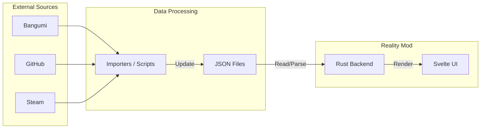

# Reality Mod

---

## 📖 项目概述

Reality Mod 是个人信息的综合管理以及可视化工具，希望能用游戏化思维管理生活。给"地球Online"加上一个用户界面。

## 💡 设计理念

Reality Mod 不是另一个用于“打卡”的习惯追踪软件。作为桌面端软件，更强调信息的整理和综合。

虽然希望以游戏的方式管理生活，但希望呈现的数据有真实意义。因此不会有"今天干了某件事，某某属性+x"这样强行模仿RPG游戏的功能。

Reality Mod 希望能找到现实与游戏共性的地方，并加以呈现，但不会强行把现实往游戏的框架里套。

## 🧩 功能模块

作为"地球Online"的用户界面，Reality Mod 初步计划提供六个主要功能模块：

### 📊 Status

身体与生活数据中心。

- 以可插拔指标方式管理健康与运动表现数据（如身高/体重、三大项 5RM、器械动作、1km 用时、5km 配速）。
- MVP 阶段先展示静态状态数据，趋势图后续迭代。

### 🏆 Achievements

成就系统。

- 记录每一个里程碑的解锁时间。提供时间轴视图，回溯成长轨迹。
- 成就有不同的难度等级，在视觉上进行区分。
- 成就不强制要求证明，这是自我管理工具，而不是PVP游戏。
- 成就可以有所依赖，完成前置成就后，才能解锁更高阶的成就。
- 每个人所关注的成就类型有所不同。支持根据个人兴趣加载不同的成就包。
  - 例如程序员一般不会想要跟踪"临摹了10个字帖"这样的成就。
  - 可以加载和自己职业或者兴趣相关的成就包。

### 🌳 Skills

技能树系统。与成就系统高度关联。

- 技能树上的每一个节点都对应成就系统中的一个成就。但是成就系统中的成就不一定对应技能树上的节点。
- 加载了成就包后，技能系统中才会跟踪相关技能。
  - 例如，加载了程序员成就包后，技能系统中就会跟踪"Python"这个技能。
- 随着成就的解锁，对应的技能树中的节点被点亮。技能也会逐渐升级。
  - 技能树中的节点有不同的积分。根据积分以及是否完成相关重要成就（技能树节点），可以计算出当前的技能等级。
  - 一个成就可能对应多个技能树节点。但是在对应技能树中的积分可以不同。

### 📦 Items

物品系统。

- 记录衣服、数码产品。通过实际数据提醒自己谨慎消费。

### 🖼️ Gallery

聚合阅读、观影、游戏数据。

- 提供相关脚本，自动化更新你的阅读、观影、游戏数据，转换成Reality Mod 的 JSON 格式。

### 🛠️ Crafting

类似游戏里的创造系统，提示需要多少材料，以及如何制作。

- 对应到现实生活，主要是记录一下自己学会的菜谱。

---

## ⚙️ 架构设计

Reality Mod 目前采用纯 **Local-First** 的架构，所有数据存储于本地 JSON 文件中。

### 内容包系统与用户配置

- **用户基础信息**：`data/user_profile.json`
- **Status 指标定义**：`data/status_metric_definitions.json`
- **Status 指标数值**：`data/status.json`
- **内容包**：定义技能树结构、成就规则的 JSON 文件

### 数据流



---

## 🛠️ 技术栈

- **核心框架**: Tauri v2 (Rust)
- **前端**: Svelte + TypeScript
- **样式**: Tailwind CSS
- **数据存储**: 本地 JSON 文件

---

## 📚 文档

- [架构设计](docs/architecture.md) - 详细的架构设计文档
- [目录结构说明](docs/directory_structure.md) - 项目目录结构说明
- [Schema 总览](docs/schema/README.md) - 数据结构文档导航
- [Status Schema](docs/schema/status.md) - Status 指标定义与数值结构

---

## 🚀 快速开始

### 环境要求

- **Rust**: `stable` toolchain
- **Node.js**: (For frontend build)

### 安装步骤

```bash
# 1. 克隆仓库
git clone https://github.com/yourusername/reality-mod.git
cd reality-mod

# 2. 安装依赖
npm install

# 3. 运行开发模式
npm run tauri dev
```

### 配置

在 `data/` 目录下创建本地数据文件（该目录默认被 `.gitignore` 忽略）。

详细结构请参考：

- [Schema 总览](docs/schema/README.md)
- [Status Schema](docs/schema/status.md)

---

## 🛣️ 开发路线

### 阶段一：概念与设计 ✅

- [x] 定义核心模块 (Status, Skills, Achievements, Items, Gallery, Crafting)
- [x] 确定技术栈 (Tauri v2 + Svelte)
- [x] 完成架构设计文档 (docs/architecture.md)

### 阶段二：MVP - Status 模块原型

**目标**: 完成最小可用原型，验证技术栈和架构设计

- [x] **项目初始化**
  - [x] 创建 Tauri 项目骨架
  - [x] 配置 Svelte + Tailwind CSS
  - [x] 搭建基础目录结构

- [ ] **Status 模块开发**
  - [x] 设计 Status 数据的 JSON Schema（支持可插拔指标定义与指标值分离）
  - [ ] 实现 Rust 端 JSON 文件读取
  - [ ] 实现 Tauri Command: `load_status_data`
  - [ ] 创建 Status 页面 UI（先数据卡片，后续趋势图）

- [ ] **交互体验**
  - [x] 实现全局快捷键唤出/隐藏窗口（如 Ctrl+Shift+R）
  - [ ] 实现鼠标手势支持（可选）
  - [ ] 窗口置顶、透明度调节等桌面 HUD 特性

- [ ] **数据演示**
  - [x] 创建示例 JSON 数据文件
  - [ ] 实现基础数据可视化（折线图/柱状图）

**设计原则**：

- JSON Schema 按需设计，不追求一次性完善
- 功能优先于完美，快速验证想法

### 阶段三：Achievements & Skills 系统

**目标**: 实现核心的成就和技能树系统

- [ ] **成就系统**
  - [ ] 设计 Achievement JSON Schema
  - [ ] 实现成就列表展示
  - [ ] 实现成就解锁功能
  - [ ] 实现成就时间轴视图
  - [ ] 支持成就依赖关系检查

- [ ] **技能树系统**
  - [ ] 设计 Skill Tree JSON Schema
  - [ ] 实现基于 DAG 的技能树可视化渲染
  - [ ] 实现技能等级计算逻辑
  - [ ] 技能树与成就系统联动

- [ ] **内容包系统**
  - [ ] 设计内容包结构
  - [ ] 实现内容包加载/卸载功能
  - [ ] 创建示例内容包（程序员/健身）

### 阶段四：Items 物品系统

**目标**：实现物品管理功能

- [ ] 设计 Items JSON Schema
- [ ] 实现物品列表展示
- [ ] 实现物品分类（衣服、数码产品等）
- [ ] 实现物品详情页
- [ ] 添加购买日期、价格等统计功能

### 阶段五：Gallery 媒体画廊

**目标**：聚合阅读、观影、游戏数据

- [ ] 设计媒体数据的 JSON Schema（书籍、电影、游戏）
- [ ] 实现 Gallery 封面墙展示
- [ ] 实现数据筛选和排序
- [ ] 创建外部数据导入脚本
  - [ ] Bangumi 导入脚本
  - [ ] Steam 导入脚本
  - [ ] Goodreads/豆瓣读书导入脚本

### 阶段六：Crafting 制作系统

**目标**：实现配方管理功能

- [ ] 设计配方的 JSON Schema
- [ ] 实现菜谱列表展示
- [ ] 实现配方详情（材料、步骤）
- [ ] 支持自定义添加配方

### 阶段七：优化与完善

- [ ] 数据导出/备份功能
- [ ] 主题系统（暗色/亮色模式）
- [ ] 性能优化
- [ ] 用户文档和使用指南
- [ ] 跨平台测试（Windows / macOS / Linux）
