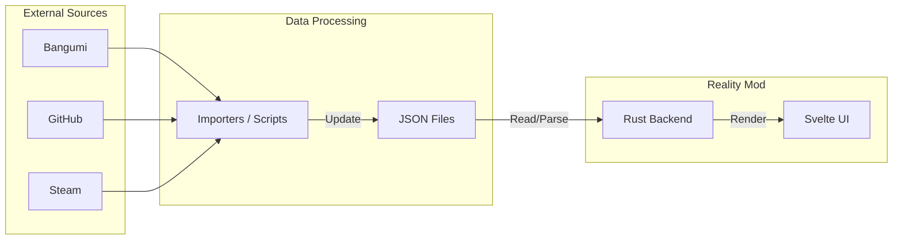

# Reality Mod

---

## 📖 项目概述

Reality Mod 是个人信息的综合管理以及可视化工具，希望能用游戏化思维管理生活。给"地球Online"加上一个用户界面。

## 💡 设计理念

Reality Mod 不是另一个用于“打卡”的习惯追踪软件。作为桌面端软件，更强调信息的整理和综合。

虽然希望以游戏的方式管理生活，但希望呈现的数据有真实意义。因此不会有"今天干了某件事，某某属性+x"这样强行模仿RPG游戏的功能。

Reality Mod 希望能找到现实与游戏共性的地方，并加以呈现，但不会强行把现实往游戏的框架里套。

## 🧩 Modules (功能模块)

作为"地球Online"的用户界面，Reality Mod 初步计划提供六个主要功能模块：

### 📊 Status

身体与生活数据中心。

- 接入运动数据（卧推 1RM、5km 配速）。
- 可视化呈现身体机能趋势。

### 🏆 Achievements

成就系统。

- 记录每一个里程碑的解锁时间。提供时间轴视图，回溯成长轨迹。
- 成就有不同的难度等级，在视觉上进行区分。
- 成就不强制要求证明，这是自我管理工具，而不是PVP游戏。
- 成就可以有所依赖，完成前置成就后，才能解锁更高阶的成就。
- 每个人所关注的成就类型有所不同。支持根据个人兴趣加载不同的成就包。
  - 例如程序员一般不会想要跟踪"临摹了10个字帖"这样的成就。
  - 可以加载和自己职业或者兴趣相关的成就包。

### 🌳 Skills

技能树系统。与成就系统高度关联。

- 技能树上的每一个节点都对应成就系统中的一个成就。但是成就系统中的成就不一定对应技能树上的节点。
- 加载了成就包后，技能系统中才会跟踪相关技能。
  - 例如，加载了程序员成就包后，技能系统中就会跟踪"Python"这个技能。
- 随着成就的解锁，对应的技能树中的节点被点亮。技能也会逐渐升级。
  - 技能树中的节点有不同的积分。根据积分以及是否完成相关重要成就（技能树节点），可以计算出当前的技能等级。
  - 一个成就可能对应多个技能树节点。但是在对应技能树中的积分可以不同。

### 📦 Items

物品系统。

- 记录衣服、数码产品。通过实际数据提醒自己谨慎消费。

### 🖼️ Gallery

聚合阅读、观影、游戏数据。

- 提供相关脚本，自动化更新你的阅读、观影、游戏数据，转换成Reality Mod 的 JSON 格式。

### 🛠️ Crafting

类似游戏里的创造系统，提示需要多少材料，以及如何制作。

- 对应到现实生活，主要是记录一下自己学会的菜谱。

---

## ⚙️ Architecture (架构设计)

Reality Mod 目前采用纯 **Local-First** 的架构，所有数据存储于本地 JSON 文件中。

### The Pack System & Profile

- **User Profile**: 存储用户基础信息与当前状态。
- **Content Packs**: 定义技能树结构、成就规则的 JSON 文件。

### Data Pipeline



---

## 🛠️ Tech Stack (技术栈)

- **Core**: Tauri v2 (Rust)
- **Frontend**: Svelte + TypeScript
- **Styling**: Tailwind CSS
- **Storage**: Local JSON Files

---

## 🚀 Getting Started

### Prerequisites

- **Rust**: `stable` toolchain
- **Node.js**: (For frontend build)

### Installation

```bash
# 1. Clone the repository
git clone https://github.com/yourusername/reality-mod.git
cd reality-mod

# 2. Install dependencies
npm install

# 3. Run in Development Mode
npm run tauri dev
```

### Configuration

Create your profile in the `data/` directory.

`data/user_profile.json`:

```json
{
  "username": "User01",
  "data_sources": {
    "github_token": "env:GITHUB_TOKEN"
  }
}
```

---

## 🛣️ Roadmap

### Phase 1: Concept & Design

- [x] 定义核心模块 (Dashboard, Skills, Crafting, etc.)
- [x] 确定技术栈 (Tauri + Svelte)
- [ ] 设计 JSON 数据结构

### Phase 2: MVP Development

- [ ] **Core**: 实现 JSON 配置文件的读取与解析
- [ ] **UI**: 完成 Svelte 基础布局与 HUD 界面
- [ ] **Skills**: 实现基于 DAG 的技能树可视化渲染

### Phase 3: TBD
