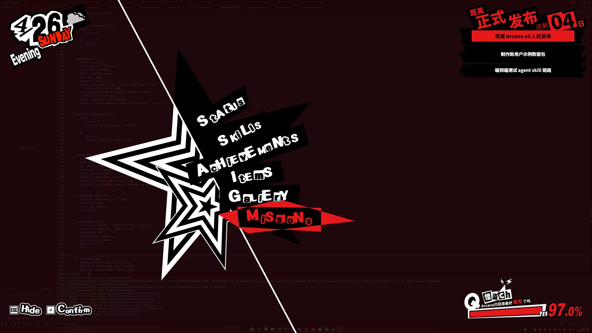
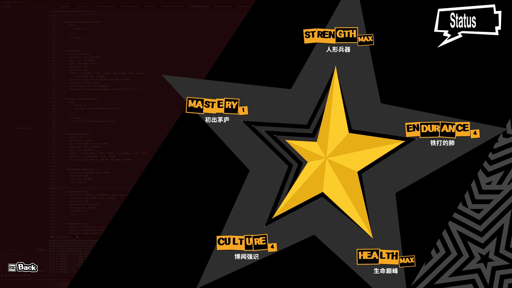
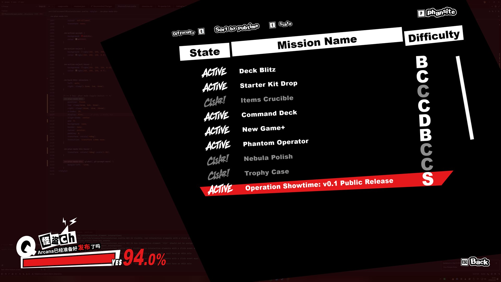
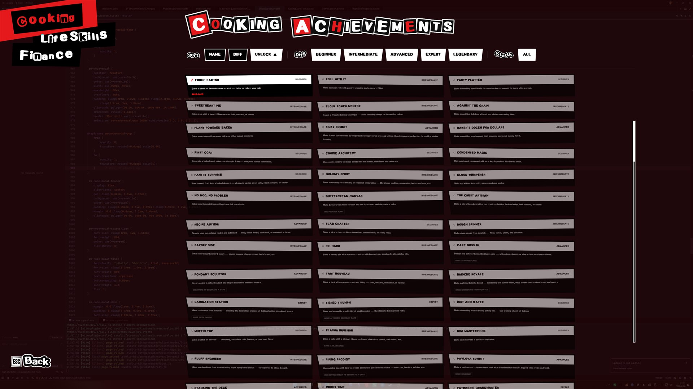
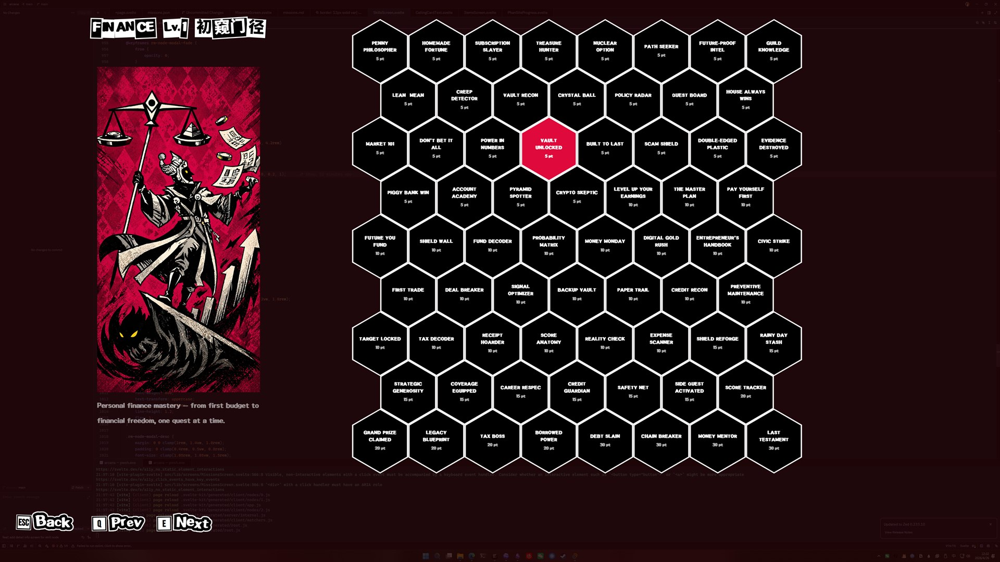
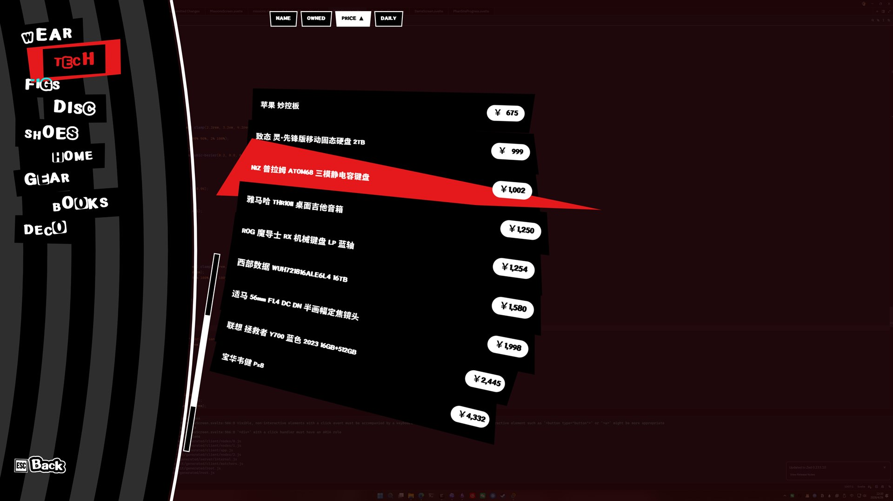

# Arcana

[English](README.md) | [简体中文](README.zh-CN.md)

An AI-guided, Persona 5-inspired HUD for gamified life management.

> [!IMPORTANT]
> Arcana is designed to work best as an AI-assisted life management tool: the AI agent helps interpret updates, propose missions, and keep local JSON data coherent. For the intended visual experience, install the required fonts locally from legitimate sources; font files are not bundled with this repository or release builds. See [Font Requirements](#font-requirements).

---

## Project Overview

Arcana is an AI-guided desktop HUD for turning real-life progress into structured game-like systems: status dimensions, missions, achievements, skills, inventory, and media history. It stores your data locally as JSON and uses an AI agent to help interpret updates, propose missions, track progress, and keep the system coherent over time.

> [!NOTE]
> The paragraph above describes the current implementation. The approved next architecture replaces runtime JSON with SQLite while keeping deterministic, human-readable JSON in a private Git repository for sync. See [Target Data Platform Design](docs/design/README.md).

Arcana is **not** a streak-based habit tracker or a toy stat sheet. It borrows the visual language and motivation loops of games, but the underlying data is real: personal milestones, ongoing goals, owned items, consumed media, and measurable status signals. The goal is not to pretend life is a game, but to give real life a sharper interface.

---

## Screenshots

| Main Menu |
|-----------|
|  |

<table>
  <tr>
    <th width="50%">Status</th>
    <th width="50%">Missions</th>
  </tr>
  <tr>
    <td></td>
    <td></td>
  </tr>
  <tr>
    <th width="50%">Achievements</th>
    <th width="50%">Skills</th>
  </tr>
  <tr>
    <td></td>
    <td></td>
  </tr>
  <tr>
    <th width="50%">Items</th>
    <th width="50%">Gallery</th>
  </tr>
  <tr>
    <td></td>
    <td></td>
  </tr>
</table>

---

## Features

### Status

Multi-dimensional life radar computed from real metrics.

- Status uses a three-layer model: raw **metrics**, scored **dimensions**, and Persona-style **level titles**.
- Dimension scores are calculated from weighted metric contributions, targets, ranges, or scoring brackets.
- System metrics (`sys_` prefix) are derived automatically from other modules, such as gallery counts, skill levels, achievement stats, BMI, and game days.
- Radar chart overview with drill-down into each dimension's contributing metrics.

### Achievements

Milestone tracking with content pack support.

- Record life milestones with unlock timestamps and difficulty grades (`beginner` through `legendary`).
- Achievements can have prerequisites, forming validated DAGs of dependencies.
- Content packs load achievement sets tailored to different interests, disciplines, and life domains.
- Pack navigation, difficulty filters, unlock sorting, and locked/unlocked visual states.
- AI agent can track partial progress, append progress notes, and mark completions.

### Skills

Honeycomb-style skill progression tightly coupled with achievements.

- Each skill node maps to an achievement; unlocking achievements lights up the corresponding tree nodes.
- Skill levels are computed from accumulated points contributed only by achieved nodes.
- Interactive skill overview and honeycomb node map with achievement details, prerequisite status, and progress history.
- Loaded via content packs alongside achievements, so new packs can add both milestones and skill progression.

### Missions

AI-driven quest system for current goals and next actions.

- AI proposals remain local MissionSuggestions until the user accepts them as synchronized Missions.
- Lifecycle: pending/rejected Suggestion; accepted Mission → `active` → `completed` / `archived`.
- AI-maintained 0–100 progress, deadlines, and completion timestamps.
- Main menu integration for countdowns, progress prompts, and rotating mission hints.
- Mission completion can inform later Achievement judgment without storing a static cross-system link.

### Items

Personal inventory with cost-over-time awareness.

- Track clothing, shoes, electronics, furniture, books, collectibles, and other possessions.
- Record purchase dates, prices, purchase channels, categories, images, and notes from local item files.
- Sort and compare by name, days owned, purchase price, and daily cost.
- Category summaries and item detail views turn ownership into a more mindful data surface.

### Gallery

Aggregated media consumption and play history hub.

- Unified view of anime, games, TV, movies, and books.
- Waterfall cover wall with category filters, rating/date/playtime sorting, and detail views.
- Tracks community ratings, personal ratings, tags, dates, episodes, playtime, and Steam achievement metadata where available.
- Import scripts for external sources:
  - Bangumi (anime)
  - Steam (games)
  - Douban (movies/TV/books)

---

## AI Agent

Arcana includes a built-in AI agent that acts as a personal life assistant. There are three ways to interact with it:

| Channel | Description |
|---------|-------------|
| **External AI harness** | The local Arcana plugin provides canonical Velvet Room, Phan Site, and Pack Manager Skills against the SQLite CLI. |
| **Telegram** | Optional bot adapter for mobile / remote access (`agent-telegram`). Compile and run only when needed. |
| **Data CLI** | Machine-readable SQLite operations for scripts and future Skills (`arcana-data`). |

The Status, Achievement, Skill, and Mission screens now use the Application/Repository/SQLite stack. Items, Gallery, and the built-in Rust agent still use legacy JSON services during migration.

> `agent-cli` is a minimal debug harness for testing the agent loop without Tauri. It is not needed for normal use.

The agent can:
- Read current status, missions, achievements, and memory context
- Update mission progress and status
- Track and mark achievements
- Propose new missions based on your goals
- Maintain cross-session memory for continuity

---

## Tech Stack

- **Framework**: [Tauri v2](https://v2.tauri.app/) (Rust backend + webview frontend)
- **Frontend**: Svelte 5 + SvelteKit v2 + TypeScript + Tailwind CSS v4 + Three.js
- **Backend**: Rust (IPC commands, AI agent, legacy JSON services, and the new SQLite Repository)
- **Data**: Status, Achievement, Skill, Mission, and `arcana-data` use local SQLite; Items, Gallery, and the built-in agent still use local JSON; deterministic JSON is the future Git synchronization format
- **AI**: Direct Anthropic API integration with tool-calling loop

---

## Project Structure

```
src/                    # SvelteKit frontend
  ├── routes/           #   Single-page app (main menu + sub-screens)
  └── lib/
      ├── screens/      #   Screen components (Status, Achievements, Skills, Items, Gallery, Missions)
      ├── components/   #   Shared UI components (RadarChart, SkillNebula, etc.)
      ├── types/        #   TypeScript type definitions
      └── utils/        #   Frontend utilities
src-tauri/src/          # Rust backend
  ├── commands/         #   Tauri IPC commands (status, achievements, skills, missions, items, gallery, weather)
  ├── models/           #   Serde data structures
  ├── domain/           #   New data-platform domain model
  ├── application/      #   New typed commands and runtime boundary
  ├── storage/          #   SQLite/JSON codec plus legacy JSON storage
  ├── services/         #   Legacy business logic retained for the built-in agent
  ├── agent/            #   AI agent subsystem (runner, LLM, tools, prompt, config, session)
  └── bin/              #   Standalone binaries: agent_cli, agent_telegram, arcana_data
data/                   # Ignored local development data
data-example/           # Legacy tracked JSON templates retained for the not-yet-migrated UI
  ├── packs/<pack_id>/  #   Content packs (manifest.json, achievements.json, skills.json)
  └── *.json            #   missions, status, achievement_progress, etc.
docs/                   # Architecture docs, schema specs, UI design guides
  └── schema/           #   JSON schema definitions
scripts/                # Python tooling (data import, schema validation)
static/                 # Static assets (icons, images)
```

---

## Quick Start

```bash
# 1. Install dependencies
npm install

# 2. Run the current desktop app
npm run tauri dev
```

The SQLite data platform can be exercised separately while the desktop UI migration is in progress:

```bash
cargo build --manifest-path src-tauri/Cargo.toml --bin arcana-data
./src-tauri/target/debug/arcana-data capabilities
./src-tauri/target/debug/arcana-data init
./src-tauri/target/debug/arcana-data pack list
./src-tauri/target/debug/arcana-data status list-dimensions
./src-tauri/target/debug/arcana-data achievement list
./src-tauri/target/debug/arcana-data skill list
./src-tauri/target/debug/arcana-data mission list
./src-tauri/target/debug/arcana-data memory list
```

`arcana-data init` creates the SQLite runtime and the `basic` Pack; it does not populate onboarding missions. The Record, Pack, Status, Achievement, Arcana Skill query, Mission, AssistantMemory, compact Agent context, dry-run, atomic user-state batch, contract fixtures, and canonical external Skills have migrated. The Tauri Status, Achievement, Skill, and Mission screens also use this runtime; Items and Gallery remain on their external/legacy sources.

> [!NOTE]
> If you want to use the agent binaries — primarily `agent-telegram`, which starts a listener service for controlling your local assistant remotely via Telegram — you will need to configure an LLM provider. Set your API key via environment variable (`ANTHROPIC_API_KEY`) or config file (`~/.arcana/agent_config.json`). See [AI Agent](#ai-agent) for details.

---

## Getting Started

### Prerequisites

- **Rust**: stable toolchain
- **Node.js**: v18+
- **Platform**: Windows / macOS / Linux

### Font Requirements

Arcana's visual style depends on a few system fonts. These font files are **not bundled with this repository or release builds**; users need to install them locally for the intended Persona 5-inspired look:

- `p5hatty` — primary display font for menus, labels, cards, and collage-style text
- `Source Han Sans SC` — Chinese UI and card-title text
- `Bebas Neue` — key hint badges

If these fonts are missing, the app will still run, but the UI will fall back to system fonts such as `Arial`, `Microsoft YaHei`, or generic `sans-serif`, and some title/card layouts may look different.

### Display Scaling Note

The current UI was primarily developed on Windows at 4K resolution with 100% display scaling. It has also received light compatibility checks on Windows 4K at 125% scaling, Windows 2K at 100% scaling, and a MacBook Air 13-inch scaled desktop around 1710x1112.

Support for other resolutions, display scaling settings, and macOS/Retina scaled modes may still have layout issues. A more unified cross-resolution layout strategy is planned for follow-up work.

### Development

```bash
# Install frontend dependencies
npm install

# Run full desktop app in dev mode
npm run tauri dev

# Or run only the frontend dev server
npm run dev
```

### Build

```bash
# Build desktop release
npm run tauri build

# Build the SQLite data CLI
cargo build --manifest-path src-tauri/Cargo.toml --bin arcana-data

# Build agent binaries (optional / on-demand)
cargo build --manifest-path src-tauri/Cargo.toml --bin agent-telegram  # Telegram bot; build when needed
cargo build --manifest-path src-tauri/Cargo.toml --bin agent-cli       # Debug harness; not needed for normal use
```

### Checks

```bash
# TypeScript / Svelte type checking
npm run check

# Rust tests
cargo test --manifest-path src-tauri/Cargo.toml

# Rust formatting
cargo fmt --manifest-path src-tauri/Cargo.toml --check
```

---

## Tooling Scripts

Arcana includes Python scripts for importing personal data, generating content packs, processing UI assets, and validating local JSON files.

Some data import scripts read credentials or user IDs from `scripts/config.json`. Use `scripts/config.example.json` as the template and keep real values local.

| Script | Purpose |
|--------|---------|
| `scripts/fetch_bangumi.py` | Fetch watched anime from Bangumi and write Gallery data. |
| `scripts/fetch_steam.py` | Fetch owned Steam games; `--detailed` also fetches achievements and store metadata. |
| `scripts/fetch_douban.py` | Fetch Douban movies, TV, and books; supports `--status all`. |
| `scripts/dev/process_assets.py` | Resize and prepare UI assets under `static/ui/`. |
| `scripts/dev/remove_bg.py` | Remove backgrounds from image files or folders. |
| `scripts/validate_data.py` | Legacy post-edit hook for JSON files under the repository-local `data/`; normal CLI/Tauri writes use Rust validation. |

```bash
python scripts/fetch_bangumi.py
python scripts/fetch_steam.py --detailed
python scripts/fetch_douban.py --status all
```

---

## Documentation

- [Architecture](docs/architecture.md) — Tauri, data layer, frontend, and agent architecture.
- [Target Data Platform Design](docs/design/README.md) — approved SQLite runtime, Git JSON sync, RecordDefinition/Record, Status, Achievement, PackForest, Mission, and memory architecture.
- [Schema Reference](docs/schema/README.md) — detailed JSON schemas for missions, achievements, skills, status, items, changelog, memory, and UI events.
- [Visual Style Guide](docs/visual_style_guide.md) — Persona 5-inspired design principles, palette, typography, and interaction rules.
- [UI Design Spec](docs/ui_design_spec.md) — main menu and sub-screen layout/interaction spec.

---

## Current Implementation Notes

- **Split migration state**: The Tauri Status, Achievement, Skill, and Mission screens plus `arcana-data` use SQLite; Items, Gallery, and the built-in agent still use legacy JSON/external sources.
- **Content Pack system**: Achievements and skills are loaded via user-extensible packs.
- **Split agent migration**: The built-in CLI/Telegram agent remains on the legacy JSON layer. Canonical external Skills now live in `plugins/arcana/skills`, with generated `.claude/skills` mirrors, versioned contract fixtures, and fixed eval scenarios.
- **Prerequisite validation**: The current Achievement model validates prerequisites as a DAG; Skills present the result as a compact honeycomb-style node map.
- **Explicit migration boundary**: `services/` is legacy UI/agent logic; migrated Tauri IPC and the SQLite CLI use `application/`, `domain/`, and `storage/sqlite/`.

---

## Acknowledgements

- [Mive82/Persona-5-Calendar](https://github.com/Mive82/Persona-5-Calendar) — calendar component reference
- [sjpiper145/MakerSkillTree](https://github.com/sjpiper145/MakerSkillTree) — grid-based skill tree layout inspiration
- [NERvGear/SAO-Utils](https://github.com/NERvGear/SAO-Utils) — game-styled desktop app inspiration
- [aliubo/persona-text-gen](https://github.com/aliubo/persona-text-gen) — collage-style (calling card) text generation reference

---

## License

MIT
