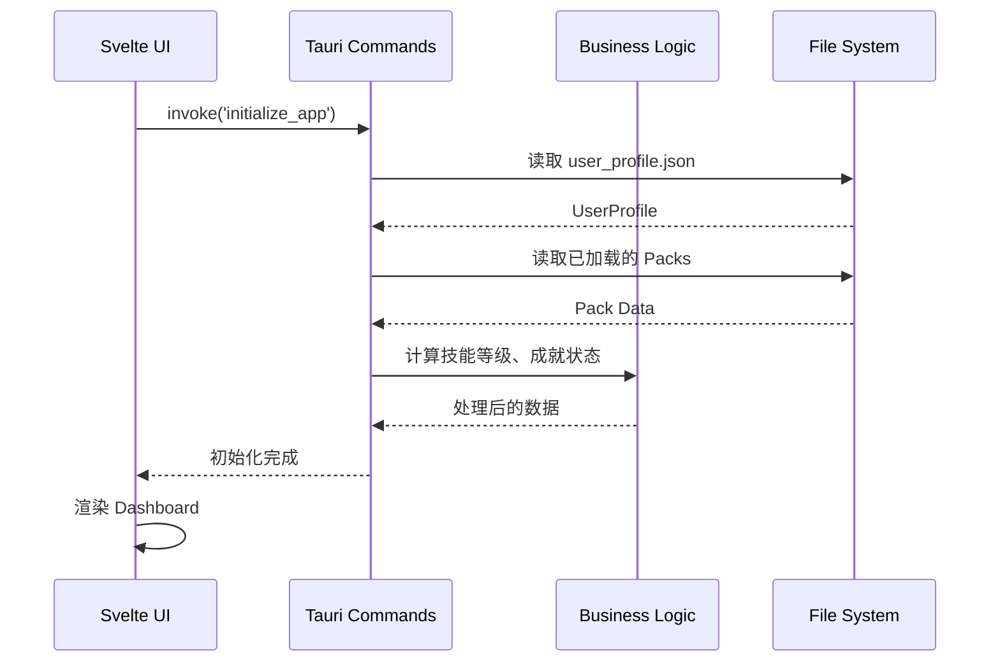
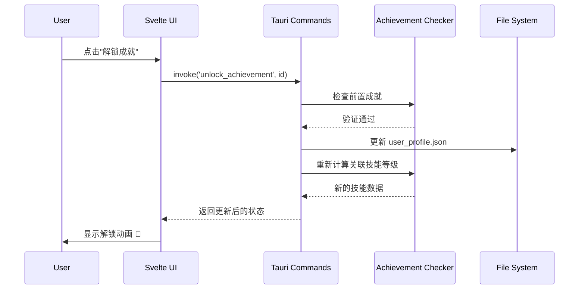
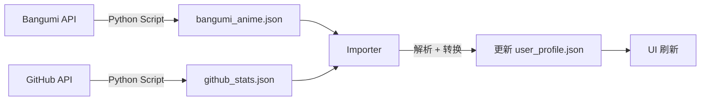

# Arcana - 架构设计文档

> **版本**: v0.1.0  
> **最后更新**: 2026-01-22  
> **状态**: Draft

---

## 📋 目录

- [1. 架构概览](#1-架构概览)
- [2. 技术栈](#2-技术栈)
- [3. 分层架构](#3-分层架构)
- [4. 目录结构](#4-目录结构)
- [5. 模块设计](#5-模块设计)
- [6. 数据流](#6-数据流)
- [7. 关键设计决策](#7-关键设计决策)
- [8. 开发规范](#8-开发规范)

---

## 1. 架构概览

Arcana 采用 **Local-First 桌面应用** 架构，基于 Tauri v2 框架，结合 Rust 后端与 Svelte 前端。

### 1.1 核心理念

- **本地优先**：所有数据存储在本地 JSON 文件，无需依赖云服务
- **模块化**：6 大功能模块独立开发，通过统一接口互通
- **插件化**：Content Packs 系统，支持动态加载不同的成就包和技能树
- **数据驱动**：UI 根据 JSON 数据自动渲染，无需硬编码

### 1.2 系统架构图

```
┌─────────────────────────────────────────────────────────────┐
│                      Svelte Frontend                        │
│  ┌──────────┐  ┌──────────┐  ┌──────────┐  ┌──────────┐   │
│  │Dashboard │  │ Skills   │  │Achievements│ │ Gallery  │   │
│  └──────────┘  └──────────┘  └──────────┘  └──────────┘   │
│         │              │              │              │       │
│         └──────────────┴──────────────┴──────────────┘       │
│                         │                                     │
│                 ┌───────▼────────┐                           │
│                 │  Svelte Stores │                           │
│                 └───────┬────────┘                           │
└─────────────────────────┼──────────────────────────────────┘
                          │ IPC (Tauri Commands)
┌─────────────────────────▼──────────────────────────────────┐
│                     Rust Backend                            │
│  ┌──────────────────────────────────────────────────────┐  │
│  │              Command Layer (Tauri)                   │  │
│  │  load_profile | load_packs | calculate_skills | ... │  │
│  └────────────────────┬─────────────────────────────────┘  │
│                       │                                     │
│  ┌────────────────────▼─────────────────────────────────┐  │
│  │              Business Logic Layer                    │  │
│  │  - Skill Calculator    - Achievement Checker         │  │
│  │  - Pack Manager        - Data Validator              │  │
│  └────────────────────┬─────────────────────────────────┘  │
│                       │                                     │
│  ┌────────────────────▼─────────────────────────────────┐  │
│  │              Data Access Layer                       │  │
│  │  - JSON Loader/Writer  - File System Manager         │  │
│  └────────────────────┬─────────────────────────────────┘  │
└───────────────────────┼──────────────────────────────────┘
                        │
┌───────────────────────▼──────────────────────────────────┐
│                  Local File System                        │
│  data/                                                    │
│  ├── profiles/          # 用户档案                        │
│  ├── packs/             # Content Packs                   │
│  └── imports/           # 外部导入数据                     │
└───────────────────────────────────────────────────────────┘
```

---

## 2. 技术栈

### 2.1 核心框架

| 技术           | 版本   | 用途                       |
| -------------- | ------ | -------------------------- |
| **Tauri**      | v2.x   | 桌面应用框架，提供原生能力 |
| **Rust**       | stable | 后端逻辑、数据处理         |
| **Svelte**     | 5.x    | 前端UI框架                 |
| **TypeScript** | 5.x    | 前端类型安全               |

### 2.2 UI & 样式

- **Tailwind CSS**: 样式框架
- **D3.js** / **vis.js**: 技能树可视化（DAG 渲染）
- **Chart.js**: 数据趋势图表

### 2.3 数据处理

- **serde** (Rust): JSON 序列化/反序列化
- **tokio** (Rust): 异步运行时（如需网络请求）

### 2.4 开发工具

- **Vite**: 前端构建工具
- **ESLint** + **Prettier**: 代码规范
- **Cargo Clippy**: Rust 代码检查

---

## 3. 分层架构

Arcana 采用 **四层架构**，职责分明：

### 3.1 展示层 (Presentation Layer) - Svelte

**职责**：

- 渲染 UI 组件
- 处理用户交互
- 调用 Tauri Commands 获取数据

**主要文件**：

- `src/routes/`: 页面路由
- `src/lib/components/`: 可复用组件
- `src/lib/stores/`: 状态管理

**示例**：

```typescript
// src/lib/stores/skillStore.ts
import { invoke } from "@tauri-apps/api/core";
import { writable } from "svelte/store";

export const skillTreeStore = writable([]);

export async function loadSkillTree() {
  const data = await invoke("load_skill_tree");
  skillTreeStore.set(data);
}
```

### 3.2 接口层 (API Layer) - Tauri Commands

**职责**：

- 定义前后端通信接口
- 参数验证
- 错误处理

**主要文件**：

- `src-tauri/src/commands/`

**示例**：

```rust
// src-tauri/src/commands/skills.rs
#[tauri::command]
pub fn load_skill_tree() -> Result<SkillTree, String> {
    let loader = JsonLoader::new();
    loader.load_skill_tree()
        .map_err(|e| e.to_string())
}
```

### 3.3 业务逻辑层 (Business Logic Layer) - Rust

**职责**：

- 技能等级计算
- 成就解锁检查
- Pack 加载/卸载
- 数据验证

**主要文件**：

- `src-tauri/src/services/`

**示例**：

```rust
// src-tauri/src/services/skill_calculator.rs
pub struct SkillCalculator;

impl SkillCalculator {
    pub fn calculate_level(achievements: &[Achievement], skill_id: &str) -> u32 {
        // 根据已解锁成就计算技能等级
    }
}
```

### 3.4 数据访问层 (Data Access Layer) - Rust

**职责**：

- JSON 文件读写
- 文件系统操作
- 数据缓存

**主要文件**：

- `src-tauri/src/storage/`

**示例**：

```rust
// src-tauri/src/storage/json_store.rs
pub struct JsonStore {
    base_path: PathBuf,
}

impl JsonStore {
    pub fn load<T: DeserializeOwned>(&self, file: &str) -> Result<T> {
        let path = self.base_path.join(file);
        let content = fs::read_to_string(path)?;
        serde_json::from_str(&content)
    }
}
```

---

## 4. 目录结构

> 💡 **完整的目录结构演变过程请参考**: [目录结构演变文档](./directory_structure.md)

Arcana 采用渐进式开发，目录结构随着开发阶段逐步扩展。以下是最终完整版本的目录结构：

```
Arcana/
│
├── src-tauri/                    # Rust 后端
│   ├── src/
│   │   ├── main.rs               # 应用入口
│   │   │
│   │   ├── models/               # 数据模型 (struct + enum)
│   │   │   ├── mod.rs
│   │   │   ├── profile.rs        # UserProfile
│   │   │   ├── achievement.rs    # Achievement
│   │   │   ├── skill.rs          # Skill, SkillTree
│   │   │   ├── pack.rs           # ContentPack
│   │   │   ├── item.rs           # Item
│   │   │   └── media.rs          # Book, Movie, Game
│   │   │
│   │   ├── storage/              # 数据存储层
│   │   │   ├── mod.rs
│   │   │   ├── json_store.rs     # 通用 JSON 读写
│   │   │   └── file_manager.rs   # 文件系统操作
│   │   │
│   │   ├── services/             # 业务逻辑层
│   │   │   ├── mod.rs
│   │   │   ├── skill_calculator.rs
│   │   │   ├── achievement_checker.rs
│   │   │   ├── pack_manager.rs
│   │   │   └── data_validator.rs
│   │   │
│   │   ├── commands/             # Tauri Commands (前后端接口)
│   │   │   ├── mod.rs
│   │   │   ├── profile.rs        # load_profile, save_profile
│   │   │   ├── skills.rs         # load_skill_tree, calculate_level
│   │   │   ├── achievements.rs   # get_achievements, unlock_achievement
│   │   │   └── packs.rs          # list_packs, load_pack
│   │   │
│   │   └── importers/            # 外部数据导入器
│   │       ├── mod.rs
│   │       ├── github.rs
│   │       └── bangumi.rs
│   │
│   ├── Cargo.toml
│   ├── tauri.conf.json           # Tauri 配置
│   └── build.rs
│
├── src/                          # Svelte 前端
│   ├── lib/
│   │   ├── components/           # UI 组件
│   │   │   ├── common/           # 通用组件
│   │   │   │   ├── Button.svelte
│   │   │   │   ├── Card.svelte
│   │   │   │   └── Modal.svelte
│   │   │   │
│   │   │   ├── skills/           # 技能树模块
│   │   │   │   ├── SkillTreeView.svelte
│   │   │   │   ├── SkillNode.svelte
│   │   │   │   └── SkillTooltip.svelte
│   │   │   │
│   │   │   ├── achievements/     # 成就模块
│   │   │   │   ├── AchievementList.svelte
│   │   │   │   ├── AchievementCard.svelte
│   │   │   │   └── Timeline.svelte
│   │   │   │
│   │   │   ├── status/           # 状态模块
│   │   │   ├── items/            # 物品模块
│   │   │   └── gallery/          # 画廊模块
│   │   │
│   │   ├── stores/               # 状态管理 (Svelte Stores)
│   │   │   ├── profileStore.ts
│   │   │   ├── skillStore.ts
│   │   │   ├── achievementStore.ts
│   │   │   └── packStore.ts
│   │   │
│   │   ├── utils/                # 工具函数
│   │   │   ├── formatters.ts     # 日期、数字格式化
│   │   │   ├── validators.ts     # 前端数据验证
│   │   │   └── graph.ts          # DAG 图算法
│   │   │
│   │   └── types/                # TypeScript 类型定义
│   │       ├── profile.ts
│   │       ├── skill.ts
│   │       └── achievement.ts
│   │
│   ├── routes/                   # 页面路由 (SvelteKit)
│   │   ├── +layout.svelte        # 全局布局
│   │   ├── +page.svelte          # 首页 (Dashboard)
│   │   │
│   │   ├── skills/
│   │   │   └── +page.svelte
│   │   │
│   │   ├── achievements/
│   │   │   └── +page.svelte
│   │   │
│   │   ├── status/
│   │   ├── items/
│   │   └── gallery/
│   │
│   ├── app.html                  # HTML 模板
│   └── app.css                   # 全局样式 + Tailwind
│
├── data/                         # 本地数据存储
│   ├── profiles/
│   │   └── default.json          # 默认用户档案
│   │
│   ├── packs/                    # Content Packs
│   │   ├── programmer/
│   │   │   ├── achievements.json
│   │   │   └── skills.json
│   │   │
│   │   ├── fitness/
│   │   │   ├── achievements.json
│   │   │   └── skills.json
│   │   │
│   │   └── meta.json             # Pack 元数据索引
│   │
│   └── imports/                  # 外部导入数据
│       ├── github_stats.json
│       ├── bangumi_anime.json
│       └── steam_games.json
│
├── scripts/                      # 数据导入脚本
│   ├── import_bangumi.py
│   ├── import_github.py
│   └── import_steam.py
│
├── docs/                         # 文档
│   ├── architecture.md           # 架构设计 (本文档)
│   ├── data_schema.md            # 数据结构定义
│   └── pack_creation_guide.md   # Pack 制作指南
│
├── public/                       # 静态资源
│   └── icons/
│
├── package.json
├── svelte.config.js
├── tailwind.config.js
├── tsconfig.json
├── vite.config.ts
└── README.md
```

---

## 5. 模块设计

### 5.1 六大功能模块

每个模块遵循统一的设计模式：

```
模块/
├── 数据模型 (Rust models/)
├── 业务逻辑 (Rust services/)
├── API 接口 (Rust commands/)
└── UI 组件 (Svelte components/)
```

#### 模块职责分工

| 模块             | 数据来源            | 核心逻辑           | UI 特点       |
| ---------------- | ------------------- | ------------------ | ------------- |
| **Status**       | 手动输入 + 外部API  | 数据趋势计算       | 图表展示      |
| **Achievements** | Pack定义 + 用户标记 | 解锁检查、依赖判断 | 时间轴 + 卡片 |
| **Skills**       | 由Achievements计算  | 等级计算、DAG渲染  | 技能树图      |
| **Items**        | 手动输入            | 分类统计           | 列表 + 详情   |
| **Gallery**      | 导入脚本            | 聚合展示           | 封面墙        |
| **Crafting**     | 手动输入            | 配方管理           | 卡片列表      |

### 5.2 Pack System 设计

Content Packs 是 Arcana 的核心特性，支持动态加载不同的成就包。

#### Pack 结构

```
packs/
└── programmer/
    ├── manifest.json       # Pack 元信息
    ├── achievements.json   # 成就定义
    └── skills.json         # 技能树定义
```

#### Pack 加载流程

```rust
// 1. 扫描 packs/ 目录
// 2. 读取 manifest.json
// 3. 验证版本兼容性
// 4. 加载 achievements + skills
// 5. 合并到当前 Profile
```

#### Pack 之间的关系

- **独立性**：每个 Pack 独立定义成就和技能
- **互斥性**：同一个成就 ID 只能存在于一个 Pack
- **组合性**：用户可同时加载多个 Pack

---

## 6. 数据流

### 6.1 启动流程



### 6.2 成就解锁流程



### 6.3 外部数据导入流程



---

## 7. 关键设计决策

### 7.1 为什么选择 Tauri 而不是 Electron？

| 对比项   | Tauri              | Electron      |
| -------- | ------------------ | ------------- |
| 包体积   | ~3-5 MB            | ~100+ MB      |
| 内存占用 | 低 (原生渲染)      | 高 (Chromium) |
| 安全性   | 高 (Rust 内存安全) | 中 (Node.js)  |
| 性能     | 优秀               | 一般          |
| 生态     | 较新               | 成熟          |

**结论**：Arcana 是本地工具，不需要复杂的网络功能，Tauri 的轻量化和高性能更合适。

### 7.2 为什么选择 JSON 而不是 SQLite？

- **简单性**：JSON 易于阅读和手动编辑
- **可移植性**：直接复制 `data/` 目录即可备份/迁移
- **版本控制**：JSON 文件可直接用 Git 管理
- **规模**：Arcana 数据量不大，JSON 性能足够

**未来可能迁移到 SQLite 的场景**：

- 数据量超过 10,000 条记录
- 需要复杂查询（如全文搜索）
- 需要事务支持

### 7.3 为什么采用 DAG (有向无环图) 渲染技能树？

- **依赖关系**：技能之间存在前置关系
- **灵活性**：不强制树状结构，允许多父节点
- **可视化**：符合游戏技能树的直觉

**技术选型**：

- 前端使用 **D3.js** 的 `d3-dag` 库
- 后端 Rust 用 `petgraph` 进行拓扑排序和路径计算

### 7.4 分层架构的严格程度

**原则**：

- ✅ **允许**：上层调用下层
- ❌ **禁止**：下层调用上层、跨层调用

**例外**：

- Svelte Stores 可以直接调用 Tauri Commands（避免过度抽象）

---

## 8. 开发规范

### 8.1 命名约定

#### Rust

- **文件名**：snake_case (`skill_calculator.rs`)
- **Struct/Enum**：PascalCase (`UserProfile`, `AchievementStatus`)
- **函数/变量**：snake_case (`calculate_level`, `user_id`)

#### TypeScript/Svelte

- **文件名**：PascalCase (组件) 或 camelCase (工具)
- **组件**：PascalCase (`SkillTreeView.svelte`)
- **函数/变量**：camelCase (`loadProfile`, `userId`)

### 8.2 Commit 规范

采用 [Conventional Commits](https://www.conventionalcommits.org/)：

```
feat: 添加技能树 DAG 渲染
fix: 修复成就解锁时的依赖检查
docs: 更新架构设计文档
refactor: 重构数据加载逻辑
```

### 8.3 错误处理

#### Rust

```rust
// 使用 Result<T, E>
pub fn load_profile(path: &str) -> Result<UserProfile, LoadError> {
    // ...
}

// 自定义错误类型
#[derive(Debug)]
pub enum LoadError {
    FileNotFound,
    ParseError(String),
}
```

#### TypeScript

```typescript
// 在 Tauri 调用层捕获错误
try {
  const profile = await invoke("load_profile");
} catch (error) {
  console.error("Failed to load profile:", error);
  showErrorToast(error);
}
```

### 8.4 测试策略

- **单元测试**：Rust 业务逻辑（`cargo test`）
- **集成测试**：Tauri Commands
- **E2E 测试**：暂不实施（MVP 阶段）

---

## 附录

### A. 相关文档

- [目录结构演变](./directory_structure.md)
- [数据结构设计](./data_schema.md) (待创建)
- [Pack 制作指南](./pack_creation_guide.md) (待创建)
