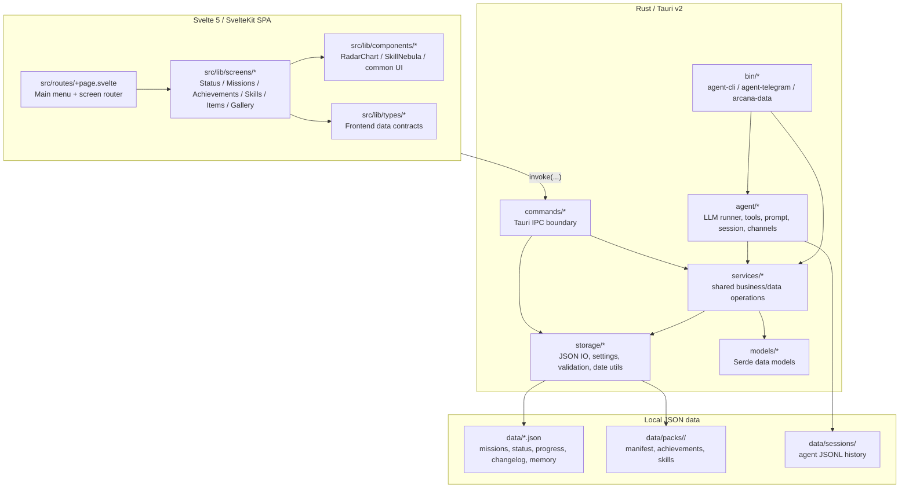
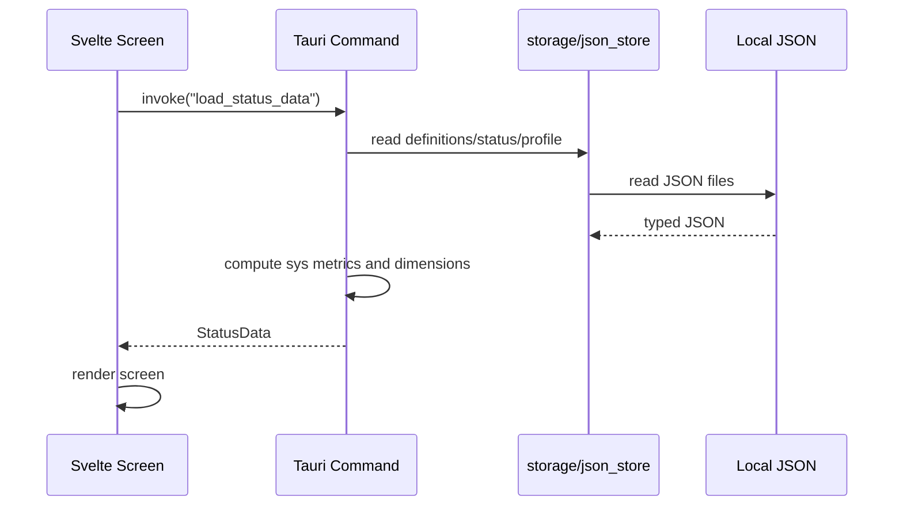
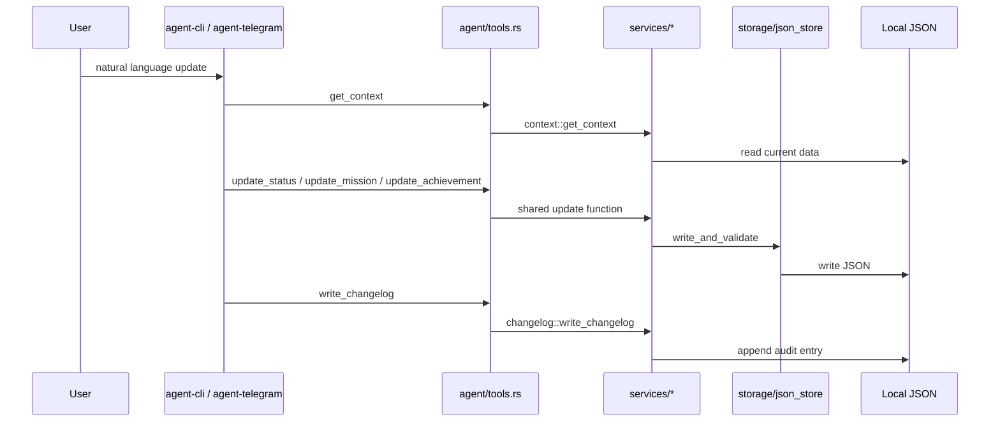

# Arcana 架构设计文档

> **版本**: v0.1.0
> **最后更新**: 2026-04-29
> **状态**: Active

Arcana 是一个 Persona 5 风格的游戏化人生管理桌面应用，也就是给 “Earth Online” 加一层用户界面。当前实现已经从早期的 Status MVP 演进为一个本地优先的桌面 HUD：前端负责高表现力的菜单与模块屏幕，Rust 后端负责本地 JSON 数据、校验、系统指标计算、AI agent 与结构化数据入口。

---

## 1. 架构概览

Arcana 采用 **Local-First + Tauri Shell + Shared Services** 架构。

核心原则：

- **本地优先**：运行时数据存在本地 JSON 文件中，不依赖数据库；`data/` 是开发仓库中的示例/运行数据，真实安装可通过 `ARCANA_DATA_DIR` 或 `~/.arcana/settings.json` 指向用户数据目录。
- **共享业务层**：Tauri IPC、独立 AI agent、`arcana-data` CLI 都复用 `src-tauri/src/services/`，避免多入口各写一套数据规则。
- **数据驱动 UI**：Status、Missions、Achievements、Skills、Items、Gallery 都从 JSON 数据和 content packs 渲染，不在 UI 中硬编码用户进度。
- **AI 可审计写入**：AI 写 missions/status/achievement progress 后必须写 `ai_changelog.json`，更新类变更保留 `old_value`。
- **Persona 5 风格表达层**：视觉风格集中在 Svelte 组件、全局 CSS、静态资源与设计文档中，后端保持数据和规则纯净。

### 1.1 当前系统图



---

## 2. 技术栈

| 层 | 技术 | 当前用途 |
| --- | --- | --- |
| 桌面壳 | Tauri v2 | 原生窗口、全局快捷键、IPC command、图片代理协议 |
| 后端 | Rust 2021 | 数据模型、JSON IO、校验、Status 计算、AI agent、CLI |
| 前端 | Svelte 5 + SvelteKit v2 + TypeScript | 单页 HUD、菜单、模块屏幕、交互状态 |
| 样式 | Tailwind CSS v4 + 全局 CSS | P5 风格几何 UI、动画、响应式布局 |
| 3D/可视化 | Three.js, Canvas/SVG/CSS | SkillNebula、雷达图与动态视觉组件 |
| AI | Anthropic API via Rust agent | tool-calling loop、CLI/Telegram 运行模式 |
| 数据 | 本地 JSON | 无数据库；schema 文档在 `docs/schema/` |
| 工具 | Python scripts | 数据导入、schema/数据校验 |

当前 `package.json` 中没有 D3、vis.js、Chart.js；技能和图表渲染由项目内 Svelte 组件实现。当前 `Cargo.toml` 中也没有 `rmcp` 依赖，结构化 AI 数据入口是 `arcana-data` CLI 和 Rust agent tools。

---

## 3. 分层架构

### 3.1 Frontend Presentation

位置：

- `src/routes/+page.svelte`
- `src/lib/screens/`
- `src/lib/components/`
- `src/lib/types/`
- `src/lib/utils/`

职责：

- 渲染主菜单与六个主屏幕：Status、Skills、Achievements、Items、Gallery、Missions。
- 通过 `@tauri-apps/api/core` 的 `invoke` 调用后端 commands。
- 维护屏幕切换、键盘/窗口事件、模块内排序筛选与展示状态。
- 按 `docs/visual_style_guide.md` 和 `docs/ui_design_spec.md` 实现 P5 风格 UI。

当前前端更接近单页应用：`src/routes/` 只有根 layout/page，模块屏幕在 `src/lib/screens/` 中切换，而不是每个模块一个 SvelteKit route。

### 3.2 Tauri Command Boundary

位置：`src-tauri/src/commands/`

当前 command 模块：

| 模块 | 主要职责 |
| --- | --- |
| `status.rs` | 加载 status metrics、计算 dimensions 和系统指标 |
| `achievements.rs` | 加载成就包与进度，标记/锁定成就 |
| `skills.rs` | 加载技能树并根据 achievement progress 计算节点/等级 |
| `items.rs` | 加载物品来源和物品列表 |
| `gallery.rs` | 加载媒体图鉴来源与条目 |
| `missions.rs` | 加载 missions、主菜单 mission widget、更新 mission status |
| `weather.rs` | 读取天气数据 |
| `ui_events.rs` | 读取待处理 UI 事件 |

`src-tauri/src/lib.rs` 注册这些 commands，同时配置：

- 无边框窗口和伪全屏行为
- 全局快捷键召唤/隐藏窗口
- `imgproxy://` 自定义协议，用于代理和缓存远程媒体图片
- `tauri-plugin-opener` 与 `tauri-plugin-global-shortcut`

### 3.3 Shared Services

位置：`src-tauri/src/services/`

`services/` 是当前架构的关键边界。Tauri commands、Rust agent、`arcana-data` CLI 都应该优先复用这里的业务操作。

| 模块 | 职责 |
| --- | --- |
| `context.rs` | 汇总 missions/status/metric definitions/achievement progress/memory 给 AI |
| `file_access.rs` | 沙箱读取 `data/` 下文件 |
| `mission.rs` | 更新/创建 mission 和 main_menu 配置 |
| `status.rs` | 更新 status metric values，并校验 metric ID |
| `achievement.rs` | 更新 achievement progress，追加 progress detail |
| `changelog.rs` | 写 `ai_changelog.json`，限制 200 条 |
| `memory.rs` | 更新 `mission_memory.json` |
| `ui_events.rs` | 写入/读取 UI event 队列 |

设计约束：

- 写数据优先走 typed model + service，而不是在调用方直接改 JSON。
- 写入后调用共享 validator，失败则回滚。
- AI 写入除 `mission_memory.json` 外，都要伴随 changelog。

### 3.4 Storage & Validation

位置：`src-tauri/src/storage/`

| 模块 | 职责 |
| --- | --- |
| `json_store.rs` | JSON read/write、`write_and_validate`、data dir resolution |
| `validate.rs` | Rust 侧纯校验逻辑，无 I/O |
| `settings.rs` | `~/.arcana/settings.json` 与路径展开 |
| `date_utils.rs` | 日期解析、天数计算 |

Data dir resolution 优先级：

1. `ARCANA_DATA_DIR`
2. `~/.arcana/settings.json` 的 `data_dir`
3. 默认 `~/.arcana/data`，不存在则创建

开发仓库中的 `data/` 仍用于本地开发、示例数据和脚本工具。

### 3.5 AI Agent & Data CLI

位置：

- `src-tauri/src/agent/`
- `src-tauri/src/bin/agent_cli.rs`
- `src-tauri/src/bin/agent_telegram.rs`
- `src-tauri/src/bin/arcana_data.rs`

当前 AI 相关入口：

| 入口 | 用途 |
| --- | --- |
| `agent-cli` | 终端运行的对话 agent |
| `agent-telegram` | Telegram bot 适配器 |
| `arcana-data` | 面向 Codex/脚本/AI skills 的结构化数据操作 CLI |

Agent 子系统：

| 模块 | 职责 |
| --- | --- |
| `runner.rs` | LLM tool-calling 主循环 |
| `llm.rs` | Anthropic API 请求/响应 |
| `tools.rs` | 工具注册与执行，代理到 `services/` |
| `prompt.rs` | 系统提示词 |
| `config.rs` | 默认值、用户级、项目级、环境变量配置 |
| `session.rs` | JSONL 会话历史 |
| `bus.rs` | agent 内部消息/事件总线 |
| `channels/` | Telegram 等外部通道 |

Agent 当前工具集：

- `get_context`
- `read_file`
- `update_mission`
- `update_status`
- `update_achievement`
- `write_changelog`

`arcana-data` CLI 提供相同方向的结构化操作：`context`、`read`、`mission update/create/update-menu`、`status update`、`achievement update`、`changelog write`、`memory update`。

历史文档 `docs/ai_agent_integration.md` 提到的 MCP Server 是早期/规划设计；当前代码实现中没有 `mcp-server` binary 或 `rmcp` 依赖。

---

## 4. 当前目录结构

```text
src/
  routes/
    +layout.svelte
    +layout.ts
    +page.svelte              # SPA 主菜单与 screen router
  lib/
    screens/                  # Status, Achievements, Skills, Items, Gallery, Missions
    components/               # Shared UI components
      common/
      status/
    types/                    # Frontend TS data contracts
    utils/                    # format/card title helpers
    Calendar.svelte
    MenuItem.svelte
    PhanSiteProgress.svelte
    ...

src-tauri/src/
  lib.rs                      # Tauri app setup, commands, imgproxy, global shortcut
  main.rs
  commands/                   # IPC commands
  models/                     # Serde data structures
  storage/                    # JSON IO, settings, validation, date utils
  services/                   # Shared data/business operations
  agent/                      # AI agent runtime
    channels/
  bin/
    agent_cli.rs
    agent_telegram.rs
    arcana_data.rs

data/
  packs/<pack_id>/            # Content packs: manifest, achievements, skills
  gallery/
  test_recipes/
  achievement_progress.json
  ai_changelog.json
  gallery_sources.json
  item_sources.json
  loaded_packs.json
  mission_memory.json
  missions.json
  recipe_sources.json
  status_metric_definitions.json
  status.json
  ui_events.json
  user_profile.json
  weather.json

docs/
  architecture.md
  ai_agent_integration.md
  directory_structure.md
  ui_design_spec.md
  visual_style_guide.md
  schema/

scripts/
  validate_data.py
  ...

static/
  icons/
  images and UI assets
```

---

## 5. 功能模块

| 模块 | 数据文件/来源 | 后端入口 | 前端入口 |
| --- | --- | --- | --- |
| Status | `status.json`, `status_metric_definitions.json`, `user_profile.json`, system metrics | `commands/status.rs`, `services/status.rs` | `StatusScreen.svelte`, `StatusDetailView.svelte`, `RadarChart.svelte` |
| Missions | `missions.json`, `mission_memory.json` | `commands/missions.rs`, `services/mission.rs`, `services/memory.rs` | `MissionsScreen.svelte`, `PhanSiteProgress.svelte` |
| Achievements | `data/packs/*/achievements.json`, `achievement_progress.json`, `loaded_packs.json` | `commands/achievements.rs`, `services/achievement.rs` | `AchievementsScreen.svelte` |
| Skills | `data/packs/*/skills.json`, achievement progress | `commands/skills.rs` | `SkillsScreen.svelte`, `SkillNebula.svelte` |
| Items | `item_sources.json` + source files | `commands/items.rs` | `ItemsScreen.svelte` |
| Gallery | `gallery_sources.json` + source files, image cache | `commands/gallery.rs`, `imgproxy` protocol | `GalleryScreen.svelte` |
| UI Events | `ui_events.json` | `commands/ui_events.rs`, `services/ui_events.rs` | root page event polling/listening |
| Weather | `weather.json` | `commands/weather.rs` | root page/weather display surfaces |

### 5.1 Status 三层模型

Status 使用三层数据模型：

1. `metrics[]`：指标字典，只描述 id/name/group/unit/value_type。
2. `dimensions[]`：雷达维度，包含 metric weight、target/range/brackets、level thresholds、P5 风格等级称号。
3. `status.json`：用户当前 metric values。

系统指标以 `sys_` 为前缀，由后端实时计算，不存储在 `status.json`。当前包括 gallery 计数、skill level 计数、BMI fallback、game days 等。

### 5.2 Content Pack System

Content pack 位于 `data/packs/<pack_id>/`：

```text
data/packs/<pack_id>/
  manifest.json
  achievements.json
  skills.json
```

规则：

- achievement ID 使用 `<pack_id>::<snake_case_name>`。
- `manifest.id` 必须等于目录名。
- achievement prerequisites 只引用同包 achievement，并且必须构成 DAG。
- skill `level_thresholds` 与 `max_level` 对齐，`points_required` 严格递增。
- loaded packs 由 `loaded_packs.json` 控制。

### 5.3 Mission System

Mission 是 AI 驱动的任务系统：

- 生命周期：`proposed` -> `active` -> `completed` / `archived` / `rejected`
- `progress` 为 0-100，由 AI 或 UI 写入
- `main_menu` 可配置 countdown、hints、progress widget
- rejected mission 对 UI 隐藏，但保留用于去重
- mission 可链接 achievement，形成任务到成就的进度闭环

---

## 6. 数据流

### 6.1 UI 加载模块数据



### 6.2 AI 更新数据



### 6.3 `arcana-data` CLI 写入


---

## 7. 数据与校验

Schema 文档在 `docs/schema/`：

- `achievements.md`
- `ai_changelog.md`
- `content_packs.md`
- `items.md`
- `mission_memory.md`
- `missions.md`
- `skills.md`
- `status.md`
- `ui_events.md`

校验分两层：

| 层 | 位置 | 覆盖 |
| --- | --- | --- |
| Rust shared validation | `src-tauri/src/storage/validate.rs` | missions、achievement progress、ai changelog、status、mission memory |
| Python hook/tooling | `scripts/validate_data.py` | Rust 覆盖项 + loaded packs + content pack manifest/achievements/skills + changelog freshness warning |

Rust 写入路径使用 `write_and_validate` 时会在校验失败后恢复旧文件。Python validator 用于 Codex/脚本写入后的快速反馈。

通用数据规则：

- 顶层 JSON 使用 `{"version": 1, ...}`。
- 可选字段尽量省略，不写 `null`。
- 日期为 `YYYY-MM-DD`；时间戳为 ISO 8601。
- `ai_changelog.json` 最多 200 条，FIFO 淘汰。
- `mission_memory.json` 是 AI 内部状态，变更不写 changelog。

---

## 8. 关键设计决策

### 8.1 为什么继续使用 JSON 而不是数据库

- 用户可读、可备份、可手动修复。
- content packs 天然适合文件夹结构。
- 当前数据规模较小，JSON 读写足够。
- AI 写入需要审计和回滚语义，文件级 changelog 已能覆盖当前需求。

未来迁移到 SQLite 或嵌入式数据库的信号：

- 单文件数据超过数万条，需要索引/分页。
- Gallery/Items 需要复杂搜索、聚合或全文检索。
- 多进程并发写入成为主路径。

### 8.2 为什么抽出 `services/`

早期 Tauri commands 直接读写 JSON 已经不够用，因为同一份数据现在有三类调用方：

- 桌面 UI
- Rust agent
- `arcana-data` CLI / AI skills

共享 services 让校验、changelog、回滚和业务规则集中在一处。commands 可以保留 UI 友好的 response shape；agent/CLI 可以保留工具友好的 input shape；二者底层复用同一套写入规则。

### 8.3 为什么 Status 使用 definitions + values

Status 不是简单的 key-value 面板。它需要同时支持：

- 用户手动录入的 metric values
- 后端派生的 `sys_` metrics
- 雷达维度的加权评分
- Persona 风格 level title
- 不同人生维度的可扩展配置

因此 metric definition 与 current value 分离，dimension scoring 放在 definitions 中，而不是散落在 UI。

### 8.4 为什么 Skills 绑定 Achievements

Skill 节点映射 achievement，避免用户维护两份进度。完成 milestone 后：

1. achievement progress 更新。
2. skill node 自动点亮。
3. skill level 根据 points + key achievements 计算。
4. Status 可将 skill level 汇总为系统指标。

---

## 9. 开发与验证

常用命令：

```bash
npm install
npm run dev
npm run tauri dev
npm run build
npm run tauri build
npm run check
cargo test --manifest-path src-tauri/Cargo.toml
cargo fmt --manifest-path src-tauri/Cargo.toml --check
cargo build --manifest-path src-tauri/Cargo.toml --bin agent-cli
cargo build --manifest-path src-tauri/Cargo.toml --bin agent-telegram
cargo build --manifest-path src-tauri/Cargo.toml --bin arcana-data
python scripts/validate_data.py data/missions.json
```

PR 前最低验证：

```bash
npm run check
cargo test --manifest-path src-tauri/Cargo.toml
cargo fmt --manifest-path src-tauri/Cargo.toml --check
```

开发约定：

- TypeScript/Svelte：2 空格缩进，组件/类型 `PascalCase`，变量/函数 `camelCase`。
- Rust：模块/函数 `snake_case`，结构体/枚举 `PascalCase`。
- Tauri command 错误信息应可操作。
- Commit 使用 Conventional Commits，例如 `docs: update architecture document`。

---

## 10. 相关文档

- [README](../README.md)
- [AI Agent 集成方案](./ai_agent_integration.md)
- [目录结构演变](./directory_structure.md)
- [视觉风格指南](./visual_style_guide.md)
- [UI 设计规范](./ui_design_spec.md)
- [Schema 目录](./schema/README.md)
