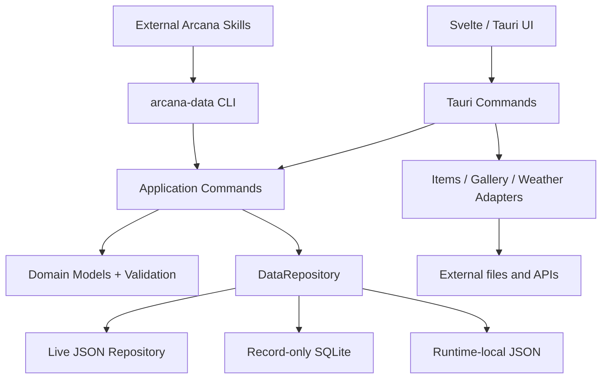

# Arcana 当前架构

> **状态**：Current
> **最后更新**：2026-08-17

Arcana 是本地优先的 Tauri 桌面应用。Svelte 提供 UI；Rust 统一承载用例、领域校验与持久化；外部 Arcana Skills 通过类型化 `arcana-data` CLI 使用这些能力，应用内不运行 LLM 或 Agent Session。

## 1. 系统边界


```mermaid
flowchart TB
    UI["Svelte / Tauri UI"] --> IPC["Tauri Commands"]
    Skills["External Arcana Skills"] --> CLI["arcana-data CLI"]
    IPC --> App["Application Commands"]
    CLI --> App
    App --> Domain["Domain Models + Validation"]
    App --> Repo["DataRepository"]
    Repo --> JSON["Live JSON Repository"]
    Repo --> SQLite["Record-only SQLite"]
    Repo --> Local["Runtime-local JSON"]
    IPC --> Adapters["Items / Gallery / Weather Adapters"]
    Adapters --> External["External files and APIs"]
```

三种存储各有唯一职责：

| 存储 | 权威数据 | 默认位置 |
| --- | --- | --- |
| 可读 JSON repository | Pack/Definition/asset、enabled Pack、AchievementState、已接受 Mission、AssistantMemory | `~/.arcana/repository` |
| SQLite | Record 及其 scalar/collection/event payload、数据库 migration/sync 元数据 | `~/.arcana/runtime/arcana.sqlite3` |
| 本机 JSON | MissionSuggestion、Status 五项选择、Mission Dashboard 槽位 | `~/.arcana/runtime/local-state.json` |

JSON repository 是日常运行时数据源，不再只是 SQLite 的导出物。Definitions 每次从该目录读取，用户可用普通编辑器修改 JSON；下一次命令读取时会执行完整领域校验。UI 和 Skill 的写操作仍应走 Application/CLI，以获得 dry-run、类型检查和一致错误。

## 2. 代码分层

- `src/`：Svelte 页面、screens 与可复用组件；不直接持久化领域数据。
- `src-tauri/src/commands/`：Tauri IPC 边界。
- `src-tauri/src/bin/arcana_data/`：Skill 与人工脚本使用的 CLI 边界。
- `src-tauri/src/application/`：Record、Pack、Status、Achievement、Skill、Mission、Memory、上下文与导入导出用例。
- `src-tauri/src/domain/`：实体、验证器与存储无关的 Repository interface。
- `src-tauri/src/storage/data_repository.rs`：把语义 JSON、Record SQLite 与本机 JSON 组合成同一 Repository interface。
- `src-tauri/src/storage/json_repository.rs`：确定性 JSON 解析、规范输出和语义文件更新。
- `src-tauri/src/storage/sqlite/record_repository.rs`：Record-only SQLite adapter。
- `src-tauri/src/storage/local_state.rs`：本机选择与建议状态。

`DataRepository` 让既有 Application Commands 不需要知道实体来自哪个物理存储。每次读取会把三者组合成一个领域快照；写入根据实体所有权路由到对应存储。

## 3. 写入与事务边界

- 多操作 `batch apply` 只接受 `record.*`，并在一个 SQLite transaction 内全成或全败。
- Pack、enabled Pack、AchievementState、Mission、AssistantMemory 各自通过单条命令更新 live JSON repository。
- MissionSuggestion、Status selection、Dashboard selection 更新 `local-state.json`。
- 不提供横跨 SQLite 与 JSON 的伪原子 batch。一次用户叙述同时涉及 Record 与语义 JSON 时，先 dry-run，再分存储顺序执行并明确报告中途失败。
- 单个 JSON 文件使用临时文件、同步和替换；涉及多个 JSON 文件的领域操作由运行时独占锁串行化，但当前不承诺进程崩溃时的跨文件原子性。

## 4. 领域关系

```text
Enabled Pack -> RecordDefinition registry
Record -> definition_id
Record -> DerivedValue -> Status Score
Record ----------------> Status Score
Status Score + DimensionDefinition -> Dimension score / level
Record + user statement + AchievementDefinition -> AchievementState
achieved Achievement + SkillDefinition -> Skill points / level
MissionSuggestion --accept--> Mission
```

- Record 是扁平的用户事实；RecordDefinition 随 Pack 发放。Definition namespace 与 Pack ID 是不同概念。
- Pack 可组成单父级 PackForest。父子关系只用于组织，启用不级联；每个 Pack 必须完整声明自己使用的 Definition。
- DerivedValue 是 Pack 定义、惰性计算且不持久化的具名数值，可依赖 Record 或其他 DerivedValue，但必须形成 DAG。
- Status Dimension 是一层加权 Status Score；Score 可直接读取数值 Record 或 DerivedValue，并裁剪到 `0..100`，四个 threshold 定义 Lv.2～Lv.5，零分为 Lv.0。
- Achievement 只持久化 `tracked` 或 `achieved` 状态。自然语言要求与可选 `tip` 帮助 Agent 判断，不存在自动解锁 DSL；Record 改变不会自动撤销 achieved。
- Skill 只从 achieved Achievement 派生积分和等级。
- 未接受推荐是本机 MissionSuggestion；接受后才成为可同步 Mission。
- AssistantMemory 只保存跨会话有价值的精炼语义，不保存完整会话。

分数、等级、Skill 节点状态、进度说明、游戏天数和剩余天数都即时派生，不重复持久化。

## 5. JSON、导入导出与 Git

`arcana-data json export` 把当前组合状态写成一个全新的确定性 JSON 目录，其中也包含从 SQLite 投影出的 `records/`。`json import` 校验完整目录，然后把语义实体写入配置的 live repository、把 Records 写入 SQLite；本机状态不从同步 JSON 导入。

当前没有 Git pull/commit/push 编排。用户可把 live repository 放入自己的 private Git repository 并按普通 Git 工作流同步；冲突直接暴露给用户，不做 CRDT、自动 merge 或 operation log。由于 Records 的 live authority 是 SQLite，完整 Git 同步闭环仍需在拉取/提交前后显式执行 Record 的 JSON import/export。

## 6. 外部来源

Items、Gallery 与 Weather 继续读取 `~/.arcana/data` 或外部 API，不属于核心数据平台。外部平台拥有其原始数据；只有显式导入为 Record 后才进入核心用户事实。

## 7. 运行与验证

```bash
npm run check
cargo test --manifest-path src-tauri/Cargo.toml
cargo fmt --manifest-path src-tauri/Cargo.toml --check
python scripts/sync_agent_skills.py --check
```

## 8. 尚未完成

- Record JSON 与 Git 的 pull/import/export/commit/push 安全闭环。
- JSON 多文件写入的 journal/恢复机制与人工编辑覆盖检测。
- Windows/macOS、分辨率和缩放比例的统一 UI 策略。
- 完整新用户引导与 Pack 创建体验打磨。

详细 Schema 与决策见 [设计文档索引](./design/README.md)。
