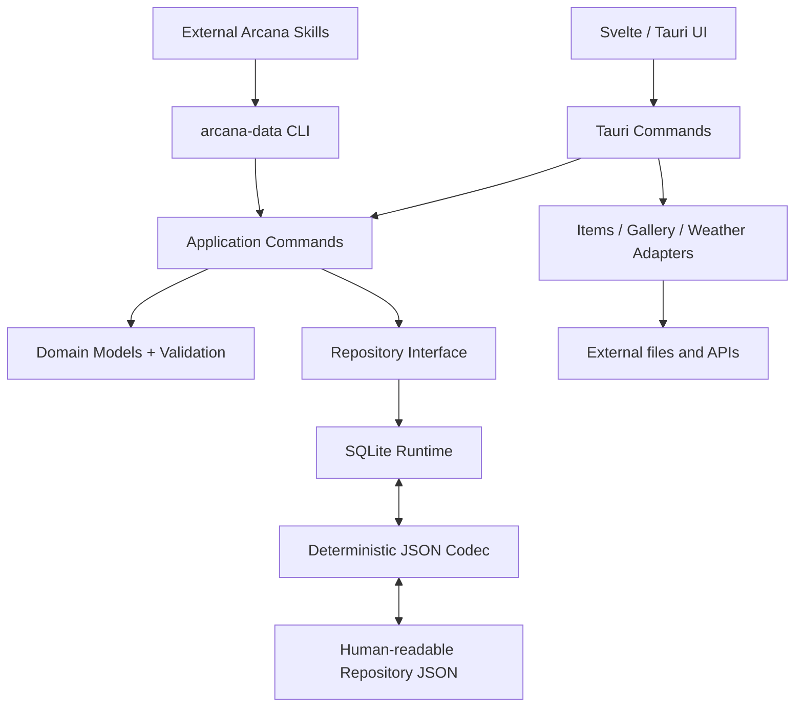

# Arcana 当前架构

> **状态**：Current
> **最后更新**：2026-08-16

Arcana 是一个本地优先的 Tauri 桌面应用。Svelte 负责高表现力 UI，Rust 提供类型化用例、领域校验、SQLite 持久化、确定性 JSON 转换和少量外部来源适配器。AI 不作为应用内服务运行，而是由外部 Skills 通过 `arcana-data` 接入。

## 1. 系统边界


```mermaid
flowchart TB
    UI["Svelte / Tauri UI"]
    Skills["External Arcana Skills"]
    CLI["arcana-data CLI"]
    IPC["Tauri Commands"]
    App["Application Commands"]
    Domain["Domain Models + Validation"]
    Repo["Repository Interface"]
    SQLite["SQLite Runtime"]
    Codec["Deterministic JSON Codec"]
    Json["Human-readable Repository JSON"]
    Adapters["Items / Gallery / Weather Adapters"]
    External["External files and APIs"]

    UI --> IPC
    IPC --> App
    Skills --> CLI
    CLI --> App
    App --> Domain
    App --> Repo
    Repo --> SQLite
    SQLite <--> Codec
    Codec <--> Json
    IPC --> Adapters
    Adapters --> External
```

依赖规则：

- UI 和 Skill 不直接写 SQLite。
- 所有核心写操作经过 Application Command、领域校验和 Repository 事务。
- 同步 JSON 是交换格式，不是运行时数据库。
- Items、Gallery、Weather 的外部来源不复制进核心数据平台。
- 应用不包含 LLM client、Agent session、Telegram channel 或另一套业务规则。

## 2. 代码分层

### Frontend

`src/routes/+page.svelte` 是主菜单与屏幕路由；`src/lib/screens/` 提供 Status、Skills、Achievements、Missions、Packs、Items 和 Gallery；`src/lib/components/` 存放雷达图、技能图等可复用组件。

前端通过 Tauri `invoke` 调用后端，不持久化领域状态。Mission Dashboard 槽位与 Status 五项选择属于本机配置，由后端单独保存。

### Tauri Commands

`src-tauri/src/commands/` 是 IPC 边界：

| 模块 | 职责 |
| --- | --- |
| `data_platform.rs` | Status、Achievement、Skill、Pack dashboard 与 mutation；Pack asset 安全读取 |
| `missions.rs` | Mission/Suggestion 查询、接受、拒绝、完成、归档和 Dashboard 配置 |
| `items.rs` | 读取 Markdown/Obsidian 物品来源并计算统计 |
| `gallery.rs` | 汇总外部媒体文件 |
| `weather.rs` | 读取本机配置并调用 Open-Meteo |

### Application

`src-tauri/src/application/` 实现 UI 与 CLI 共用的用例：运行时初始化和锁、Record、Pack、Status、Achievement、Skill、Mission、AssistantMemory、上下文摘要、批量事务与本机选择配置。Pack write/enable/disable/delete 与其他核心 mutation 共用同一 batch 事务；二进制 asset 使用独立命令。

Application 返回类型化结果，不返回 Tauri 类型，也不处理界面状态。

当前用户可修改数据的入口如下。这里的“Skill”指外部 Agent Skill，不是持久化的技能节点：

| 数据 | `arcana-data` / Agent Skill | 桌面 UI |
| --- | --- | --- |
| Record | 完整读写、删除、dry-run、batch | 暂无专用编辑器，由 Agent 记录 |
| Pack 与启用状态 | 完整读写、启停、删除、dry-run、batch | 列表、启停、删除预演与确认 |
| Pack asset | 独立 CLI / Pack Manager 操作 | 只读展示 |
| Status 展示选择 | 完整读写、dry-run、batch | 选择要展示的 Dimension |
| Achievement 状态 | 完整读写、撤销、dry-run、batch | 跟踪、完成与撤销 |
| Mission / Suggestion | 完整生命周期、dry-run、batch | 审阅和生命周期操作 |
| AssistantMemory | 完整读写、删除、dry-run、batch | 暂无专用编辑器，由 Agent 管理 |
| 本机 Dashboard 配置 | 不参与同步 | Mission 等对应界面 |

Items、Gallery、Weather 仍是外部来源适配器，不属于本次统一的核心用户数据层。

### Domain

`src-tauri/src/domain/` 定义持久化实体、验证器与 Repository 接口。关键关系是：

```text
Enabled Pack -> RecordDefinition registry
Record -> definition_id
Record + DimensionDefinition -> Status score / level
Record + user statement + AchievementDefinition -> Achievement state
achieved Achievement + SkillDefinition -> Skill points / level
MissionSuggestion --accept--> Mission
```

分数、等级、技能节点状态、成就进度说明和剩余天数均为派生值，不重复持久化。

### Storage

`src-tauri/src/storage/sqlite/` 包含 migration runner、DDL 和 Repository adapter。默认数据库位于 `~/.arcana/runtime/arcana.sqlite3`；Application 在访问时持有运行时锁。

`storage/json_repository.rs` 负责 SQLite 与规范同步目录之间的确定性转换。导出保证稳定文件划分、字段省略和排序；导入先完整解析与校验，再写入 SQLite。当前 CLI 不执行 Git 命令。

`storage/json_store.rs` 只为 Items、Gallery、Weather 读取适配配置；它不是第二套核心用户数据层。

### External Agent Skills

canonical plugin 位于 `plugins/arcana/`：

| Skill | 职责 |
| --- | --- |
| `velvet-room` | 记录事实、修正、进度、Achievement 状态、Status 选择与 AssistantMemory |
| `phan-site` | 生成、接受、拒绝和删除 MissionSuggestion |
| `pack-manager` | 创建、扩展、校验和管理 Pack |

Skill 先读取 CLI capabilities，再使用结构化 stdout/stderr 合约。`.claude/skills` 与 fixtures 是生成镜像，由 `scripts/sync_agent_skills.py` 校验。

## 3. 持久化边界

| 数据 | 权威位置 | 是否进入同步 JSON |
| --- | --- | --- |
| Record | SQLite | 是，按 namespace 分文件 |
| Pack 定义与 asset | SQLite / 规范 Pack 内容 | 是 |
| AchievementState | SQLite | 是 |
| Mission | SQLite | 是 |
| MissionSuggestion | SQLite 本机表 | 否 |
| AssistantMemory | SQLite | 是 |
| Status 五项选择 | SQLite 本机表 | 否 |
| Mission Dashboard 槽位 | SQLite 本机表 | 否 |
| Items/Gallery 外部源配置 | `~/.arcana/data` | 否 |
| Weather 配置 | `~/.arcana/data/weather.json` | 否 |
| Agent session、凭证 | 外部 Agent 自行管理 | 否 |

SQLite 与同步 JSON 的详细结构见 [`docs/design/`](./design/README.md)。系统不保留 changelog 或无限增长的 operation log；历史快照由未来的 Git 提交提供。

## 4. 核心领域行为

### Record 与 Pack

Record 是用户事实；RecordDefinition 随 Pack 发放。Definition ID 使用 `<namespace>.<name>`，namespace 不等于 Pack ID。一个 Pack 可以使用多个 namespace，不同 Pack 也可以复用同一 Definition。

Pack 可形成单父级的 PackForest，但父子关系只用于浏览和组织。启用子 Pack 不会自动启用父 Pack；跨 Pack 引用必须显式且在启用集合中可解析。

### Status

Dimension 包含若干 0～100 子 Score，最终分数是可用子 Score 的加权平均并默认裁剪到 0～100。四个 threshold 把正分映射为 Lv.1～Lv.5，0 分为 Lv.0。UI 最多展示五个本机选择的 Dimension。

### Achievement 与 Skill

Achievement 只保存 `tracked` 或 `achieved`。Agent 可以结合 Record 与自然语言 requirement 判断是否可能完成；特殊提示放在可选 `tip`，不建立自动解锁 DSL。Record 变化不会自动撤销 achieved；用户可显式撤销误操作。

Skill 节点引用 Achievement。只有 achieved 节点贡献分数，Skill 等级与节点状态即时派生。

### Mission 与 Memory

未接受推荐是本机 MissionSuggestion；接受操作原子创建同 ID 的 active Mission 并删除 suggestion。Mission 可转为 completed 或 archived。Dashboard 槽位不写入同步实体。

AssistantMemory 保存 Agent 精炼后的长期语义信息并进入同步；完整会话不属于 Arcana 数据。

## 5. 运行与验证

```bash
npm run check
cargo test --manifest-path src-tauri/Cargo.toml
cargo fmt --manifest-path src-tauri/Cargo.toml --check
cargo clippy --manifest-path src-tauri/Cargo.toml --lib --bins --tests
python scripts/sync_agent_skills.py --check
```

构建数据 CLI：

```bash
cargo build --manifest-path src-tauri/Cargo.toml --bin arcana-data
src-tauri/target/debug/arcana-data capabilities
src-tauri/target/debug/arcana-data init
```

## 6. 尚未完成

- Git pull/conflict detection/import/export/commit/push 的安全编排。
- 导出覆盖保护、崩溃恢复 journal 与临时数据库切换的完整同步闭环。
- Windows/macOS 与不同分辨率、缩放比例的统一 UI 策略。
- 完整的新用户引导与 Pack 创建体验打磨。

## 7. 相关文档

- [数据平台设计](./design/README.md)
- [视觉风格指南](./visual_style_guide.md)
- [UI 设计规范](./ui_design_spec.md)
- [Items 外部来源格式](./schema/items.md)
