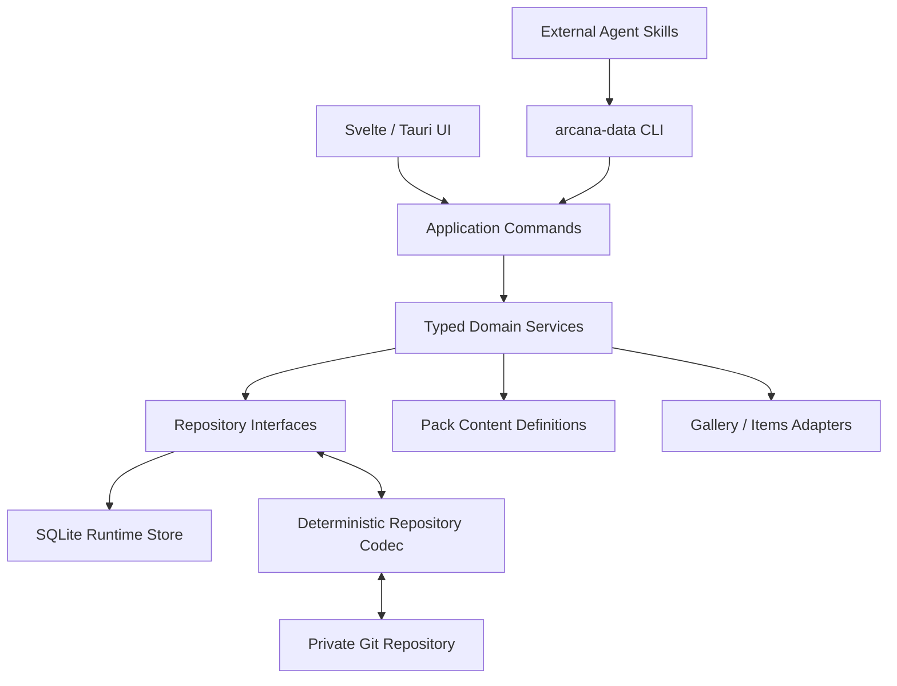

# Arcana 目标架构

> **状态**：Target / 设计已闭环，尚未全部实现
> **最后更新**：2026-08-15

## 1. 目标

第一阶段先保证 Arcana 在一台本机上可靠运行，优先级为：

1. 数据平台；
2. Status；
3. Achievement、Arcana Skill、Content Pack 与外部 Agent Skill；
4. Windows/macOS、分辨率和缩放适配；
5. 用户引导。

目标不是把现有 JSON 文件逐一搬进数据库，而是先建立统一事实层，再让各模块以明确的依赖方向消费事实。

## 2. 总体结构



所有写入口必须经过同一套 Application Command、领域校验和事务边界。UI、CLI 和 Skill 不直接写 SQLite，也不把同步 JSON 当作运行时数据库。

## 3. 核心依赖方向

```text
Record
├── selected Pack Dimension -> Dimension Score / Level
└── Agent + AchievementDefinition -> achieved state -> Arcana Skill

MissionSuggestion --accept--> Mission
Enabled Pack RecordDefinition --> Runtime Definition Registry
Record --definition_id--> Runtime Definition Registry
Pack DimensionDefinition -> local UI selection
```

- Record 是事实源。
- Status 需要确定性计算；Achievement 允许 Agent 语义判断。
- Arcana Skill 只读取状态为 `achieved` 的成就，不读取 `tracked` 状态或 Record。
- 派生的分数、等级和进度不作为新的事实回写。

## 4. 用户边界

- 一个 Git 数据仓库、一个 SQLite 数据库对应一个用户。
- 不建立 Profile、`profile_id` 或独立 UserSettings 实体。
- 普通 `basic` Pack 提供 `identity.nickname` 和 `identity.birth_date` RecordDefinition；用户值按普通 scalar Record 保存和同步。
- 应用只约定这两个标准 Definition ID：缺少昵称 Record 时显示产品默认值，缺少生日 Record 时不计算游戏天数。
- 设备配置、凭证和会话不因“属于用户”就自动进入同步范围。

## 5. 领域模块

| 模块 | 权威输入 | 持久化内容 | 派生内容 |
| --- | --- | --- | --- |
| Record | 用户明确提供的事实、导入和外部适配器 | Pack 中的 RecordDefinition、按 namespace 分组的用户 Record | 聚合查询结果 |
| Status | Record + Pack DimensionDefinition | Pack 持有 Dimension 定义；本机配置只保存五个选择 ID | 子 Score、Dimension 分数、等级 |
| Achievement | 定义、Record、用户陈述 | 最小用户状态（`tracked` / `achieved`） | 即时进度说明 |
| Arcana Skill | Pack Skill 定义 + achieved Achievement | Skill 定义属于 Pack | 积分、等级、节点状态 |
| Mission | 用户接受的任务 | active/completed/archived Mission | 剩余天数等 |
| Pack | 用户创建或导入的定义 | manifest、RecordDefinition、Dimension、Achievement、Skill | PackForest 视图 |
| AssistantMemory | Agent 精炼的长期语义信息 | 可同步 Memory | 会话上下文拼装 |

## 6. 运行时与同步边界

运行时只读写 SQLite。Git 同步使用以下显式流程：

```text
pull
-> 检查 Git 冲突
-> 全仓库解析与校验
-> 在临时数据库/单事务中导入
-> 切换 SQLite
-> 本地使用
-> 从一致性快照导出确定性 JSON
-> 校验 round-trip
-> commit / push
```

没有后台服务器，也不实现多主并发写入。默认使用场景是同一用户在设备之间顺序编辑；Git 冲突必须暴露给用户，不能由应用猜测合并。

## 7. Agent 边界

目标架构把外部 Agent Skill 视为主要智能入口，而不是核心数据层的一部分：

- Skill 通过 `arcana-data` 或等价的 typed command API 读写数据。
- Agent 可以从对话、日记或周记提取 Record，并判断 Achievement。
- Agent 不直接编辑 SQLite，不生成虚构历史数据，也不绕过验证器。
- 完整 Agent Session、模型供应商配置和凭证只保留在本机。
- 当前代码中的内置 Agent prompt 属于现状实现；新架构不维护两套相互复制的业务规则。

canonical Skill 源码、CLI contract、harness 分发和质量门见 [`agent_skills.md`](./agent_skills.md)。

## 8. 当前实现到目标架构

入口切换完成前必须区分两套文档语义：

- [`../architecture.md`](../architecture.md) 描述当前 JSON 实现；
- 本文描述迁移目标。

实现顺序从领域模型、Repository 和同步仓库 Codec 开始，再一次性切换 UI/CLI/Skill。新系统不导入旧 JSON；不能先让某个入口使用 SQLite、其他入口继续修改旧 JSON，从而形成两个权威数据源。切换后删除旧存储调用与旧 Schema 文档。
