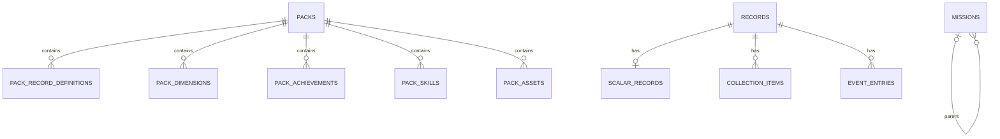

# SQLite 运行时存储

> **状态**：Target / 核心领域表、约束与本机配置结构已确定
> **最后更新**：2026-08-15

## 1. 定位

SQLite 是单机运行时的权威存储，但不是同步格式。一个用户仓库对应一个 SQLite 数据库；数据库文件、WAL、锁和 migration 状态都不进入 Git。

```text
Git repository <-> Sync Repository Codec <-> Domain Model <-> SQLite Repository
```

- UI、CLI 和外部 Agent Skill 只能调用 typed command，不能直接修改表。
- 动态业务字段保存在 JSON 列中，不拆成 EAV 表。
- scalar、collection item 和 event 按结构拆表，以支持事务更新、唯一性和时间查询。
- Pack 中的 Definition 声明是来源数据；运行时 Definition Registry 仍由已启用 Pack 派生，不建立权威的全局 Definition 表。
- 派生分数、等级、Achievement progress 和缓存不写入核心表。

## 2. 连接与事务设置

每个数据库连接必须启用：

```sql
PRAGMA foreign_keys = ON;
PRAGMA journal_mode = WAL;
PRAGMA synchronous = FULL;
PRAGMA busy_timeout = 5000;
```

打开数据库时必须先验证 `PRAGMA application_id` 等于 `0x41524341`；新数据库由 migration runner 设置该值。不能为了“修复”不匹配而覆盖未知数据库的 application ID。

- 所有修改命令使用显式事务。
- `increment`、Pack enable/disable、Record kind 变更等读后写操作使用 `BEGIN IMMEDIATE`，避免两个进程基于同一个旧值更新。
- 只读查询使用普通 read transaction；同步导出在一个一致性 read transaction 中完成。
- 数据库连接池和 CLI 进程都使用相同 PRAGMA，不能依赖某个连接曾经设置过。

## 3. 表关系



`records` 不对 `pack_record_definitions` 建外键。这是有意的：停用、删除 Pack 或暂时缺少 Definition 时，用户 Record 必须继续存在并可原样导出。

## 4. 第一版 DDL

以下 DDL 表达目标结构；迁移实现可以拆成多个 migration 文件，但最终约束必须等价。

```sql
PRAGMA application_id = 0x41524341;

CREATE TABLE schema_migrations (
    version     INTEGER PRIMARY KEY CHECK (version > 0),
    name        TEXT NOT NULL,
    checksum    TEXT NOT NULL,
    applied_at  TEXT NOT NULL
) STRICT;

CREATE TABLE sync_state (
    singleton          INTEGER PRIMARY KEY CHECK (singleton = 1),
    repository_digest  TEXT,
    data_revision      INTEGER NOT NULL DEFAULT 0 CHECK (data_revision >= 0),
    exported_revision  INTEGER NOT NULL DEFAULT 0
        CHECK (exported_revision >= 0 AND exported_revision <= data_revision)
) STRICT;

INSERT INTO sync_state(singleton) VALUES (1);

CREATE TABLE packs (
    id             TEXT PRIMARY KEY,
    enabled        INTEGER NOT NULL CHECK (enabled IN (0, 1)),
    schema_version INTEGER NOT NULL CHECK (schema_version > 0),
    manifest_json  TEXT NOT NULL
        CHECK (json_valid(manifest_json))
        CHECK (json_type(manifest_json) = 'object')
) STRICT;

CREATE TABLE pack_record_definitions (
    pack_id          TEXT NOT NULL,
    definition_id    TEXT NOT NULL,
    definition_json  TEXT NOT NULL
        CHECK (json_valid(definition_json))
        CHECK (json_type(definition_json) = 'object'),
    PRIMARY KEY (pack_id, definition_id),
    FOREIGN KEY (pack_id) REFERENCES packs(id) ON DELETE CASCADE
) STRICT;

CREATE INDEX idx_pack_record_definitions_definition
    ON pack_record_definitions(definition_id, pack_id);

CREATE TABLE pack_dimensions (
    pack_id         TEXT NOT NULL,
    dimension_id    TEXT NOT NULL,
    definition_json TEXT NOT NULL
        CHECK (json_valid(definition_json))
        CHECK (json_type(definition_json) = 'object'),
    PRIMARY KEY (pack_id, dimension_id),
    UNIQUE (dimension_id),
    FOREIGN KEY (pack_id) REFERENCES packs(id) ON DELETE CASCADE
) STRICT;

CREATE TABLE status_dimension_selection (
    position      INTEGER PRIMARY KEY CHECK (position BETWEEN 0 AND 4),
    dimension_id TEXT NOT NULL UNIQUE
) STRICT;

CREATE TABLE pack_achievements (
    pack_id          TEXT NOT NULL,
    achievement_id   TEXT NOT NULL,
    definition_json  TEXT NOT NULL
        CHECK (json_valid(definition_json))
        CHECK (json_type(definition_json) = 'object'),
    PRIMARY KEY (pack_id, achievement_id),
    UNIQUE (achievement_id),
    FOREIGN KEY (pack_id) REFERENCES packs(id) ON DELETE CASCADE
) STRICT;

CREATE TABLE achievement_states (
    achievement_id TEXT PRIMARY KEY,
    status         TEXT NOT NULL CHECK (status IN ('tracked', 'achieved')),
    achieved_at    TEXT,
    CHECK (status = 'achieved' OR achieved_at IS NULL)
) STRICT;

CREATE INDEX idx_achievement_states_status
    ON achievement_states(status, achievement_id);

CREATE TABLE pack_skills (
    pack_id          TEXT NOT NULL,
    skill_id         TEXT NOT NULL,
    definition_json  TEXT NOT NULL
        CHECK (json_valid(definition_json))
        CHECK (json_type(definition_json) = 'object'),
    PRIMARY KEY (pack_id, skill_id),
    UNIQUE (skill_id),
    FOREIGN KEY (pack_id) REFERENCES packs(id) ON DELETE CASCADE
) STRICT;

CREATE TABLE pack_assets (
    pack_id  TEXT NOT NULL,
    path     TEXT NOT NULL,
    content  BLOB NOT NULL,
    PRIMARY KEY (pack_id, path),
    FOREIGN KEY (pack_id) REFERENCES packs(id) ON DELETE CASCADE
) STRICT;

CREATE TABLE records (
    definition_id  TEXT PRIMARY KEY,
    kind           TEXT NOT NULL
        CHECK (kind IN ('scalar', 'collection', 'event'))
) STRICT;

CREATE TABLE scalar_records (
    definition_id  TEXT PRIMARY KEY,
    value_json     TEXT NOT NULL
        CHECK (json_valid(value_json))
        CHECK (json_type(value_json) IN
            ('text', 'integer', 'real', 'true', 'false')),
    effective_at   TEXT,
    recorded_at    TEXT NOT NULL,
    FOREIGN KEY (definition_id) REFERENCES records(definition_id)
        ON DELETE CASCADE
) STRICT;

CREATE TABLE collection_items (
    definition_id  TEXT NOT NULL,
    item_id        TEXT NOT NULL,
    payload_json   TEXT NOT NULL
        CHECK (json_valid(payload_json))
        CHECK (json_type(payload_json) = 'object'),
    recorded_at    TEXT NOT NULL,
    PRIMARY KEY (definition_id, item_id),
    FOREIGN KEY (definition_id) REFERENCES records(definition_id)
        ON DELETE CASCADE
) STRICT;

CREATE TABLE event_entries (
    definition_id  TEXT NOT NULL,
    event_id        TEXT NOT NULL,
    occurred_at     TEXT NOT NULL,
    payload_json    TEXT NOT NULL
        CHECK (json_valid(payload_json))
        CHECK (json_type(payload_json) = 'object'),
    recorded_at     TEXT NOT NULL,
    PRIMARY KEY (definition_id, event_id),
    FOREIGN KEY (definition_id) REFERENCES records(definition_id)
        ON DELETE CASCADE
) STRICT;

CREATE INDEX idx_event_entries_time
    ON event_entries(definition_id, occurred_at, event_id);

CREATE TABLE missions (
    id            TEXT PRIMARY KEY,
    title         TEXT NOT NULL,
    description   TEXT,
    status        TEXT NOT NULL
        CHECK (status IN ('active', 'completed', 'archived')),
    progress      INTEGER CHECK (progress BETWEEN 0 AND 100),
    difficulty    TEXT CHECK (difficulty IN ('S', 'A', 'B', 'C', 'D')),
    deadline      TEXT,
    parent_id     TEXT,
    created_at    TEXT NOT NULL,
    completed_at  TEXT,
    CHECK (id <> parent_id),
    CHECK (status IN ('completed', 'archived') OR completed_at IS NULL),
    CHECK (status <> 'completed' OR progress IS NULL OR progress = 100),
    CHECK (completed_at IS NULL OR progress IS NULL OR progress = 100),
    FOREIGN KEY (parent_id) REFERENCES missions(id)
        ON DELETE RESTRICT DEFERRABLE INITIALLY DEFERRED
) STRICT;

CREATE INDEX idx_missions_status_deadline
    ON missions(status, deadline, id);

CREATE INDEX idx_missions_parent
    ON missions(parent_id, id);

CREATE TABLE mission_suggestions (
    id                 TEXT PRIMARY KEY,
    title              TEXT NOT NULL,
    description        TEXT,
    difficulty         TEXT CHECK (difficulty IN ('S', 'A', 'B', 'C', 'D')),
    deadline           TEXT,
    parent_mission_id  TEXT,
    reason             TEXT,
    generated_at       TEXT NOT NULL,
    status             TEXT NOT NULL CHECK (status IN ('pending', 'rejected'))
) STRICT;

CREATE INDEX idx_mission_suggestions_status
    ON mission_suggestions(status, generated_at, id);

CREATE TABLE dashboard_mission_slots (
    slot        TEXT PRIMARY KEY
        CHECK (slot IN ('countdown', 'progress', 'hint_1', 'hint_2')),
    mission_id  TEXT NOT NULL,
    label       TEXT
) STRICT;

CREATE TABLE assistant_memories (
    id          TEXT PRIMARY KEY,
    kind        TEXT NOT NULL CHECK (kind IN (
        'focus', 'preference', 'constraint', 'habit',
        'summary', 'reminder', 'observation'
    )),
    content     TEXT NOT NULL,
    created_at  TEXT NOT NULL,
    updated_at  TEXT NOT NULL
) STRICT;

CREATE INDEX idx_assistant_memories_kind_updated
    ON assistant_memories(kind, updated_at, id);

CREATE TRIGGER records_kind_immutable
BEFORE UPDATE OF kind ON records
WHEN NEW.kind <> OLD.kind
BEGIN
    SELECT RAISE(ABORT, 'record kind is immutable');
END;

CREATE TRIGGER scalar_records_kind_guard
BEFORE INSERT ON scalar_records
WHEN (SELECT kind FROM records WHERE definition_id = NEW.definition_id)
    IS NOT 'scalar'
BEGIN
    SELECT RAISE(ABORT, 'scalar payload requires scalar record');
END;

CREATE TRIGGER collection_items_kind_guard
BEFORE INSERT ON collection_items
WHEN (SELECT kind FROM records WHERE definition_id = NEW.definition_id)
    IS NOT 'collection'
BEGIN
    SELECT RAISE(ABORT, 'collection item requires collection record');
END;

CREATE TRIGGER event_entries_kind_guard
BEFORE INSERT ON event_entries
WHEN (SELECT kind FROM records WHERE definition_id = NEW.definition_id)
    IS NOT 'event'
BEGIN
    SELECT RAISE(ABORT, 'event entry requires event record');
END;

CREATE TRIGGER scalar_records_parent_immutable
BEFORE UPDATE OF definition_id ON scalar_records
WHEN NEW.definition_id <> OLD.definition_id
BEGIN
    SELECT RAISE(ABORT, 'record payload parent is immutable');
END;

CREATE TRIGGER collection_items_parent_immutable
BEFORE UPDATE OF definition_id ON collection_items
WHEN NEW.definition_id <> OLD.definition_id
BEGIN
    SELECT RAISE(ABORT, 'record payload parent is immutable');
END;

CREATE TRIGGER event_entries_parent_immutable
BEFORE UPDATE OF definition_id ON event_entries
WHEN NEW.definition_id <> OLD.definition_id
BEGIN
    SELECT RAISE(ABORT, 'record payload parent is immutable');
END;
```

`manifest_json` 和 `definition_json` 保存通过领域模型规范化后的完整对象。各内容表的实体 ID 是为主键、连接和索引提取的投影；Repository 必须验证投影与 JSON 内对应字段一致。

`pack_assets.path` 是 Pack 目录下以 `assets/` 开头、使用 `/`、不含空 segment、`.`、`..` 或反斜杠的规范相对路径，并满足同步协议的跨平台 segment 规则。asset 必须是普通文件，导入拒绝符号链接；`content` 保存原始 bytes，导入/导出不得转码。这样结构化数据与所引用资源在同一次临时数据库切换中生效，运行时不直接读取可能尚未 import 的 Git 工作区文件。

UI 通过 PackAsset Repository 和受控的 Tauri asset response 读取 bytes，不把 Git 路径或数据库路径交给前端，也不直接拼接 `file://` URL。响应的媒体类型由受支持的扩展名和内容校验共同确定；找不到或不支持的 asset 返回结构化错误。

`status_dimension_selection` 是本机数据，不对 `pack_dimensions` 建外键。这样 Pack 被停用、删除或同步后暂时缺失时，选择不会被级联删除，而是由 UI 明确报告配置错误。

## 5. Record 表语义

### 5.1 Header

`records` 是用户 Record 的存在标记和结构判别器：

- 没有 header：用户尚未记录该事实；
- `kind = collection/event` 且没有子行：用户明确记录了空集合或空事件列表；
- `kind = scalar`：必须恰好存在一行 `scalar_records`；
- kind 不能原地修改；需要改变时必须创建新的 Definition/Record ID，并在用户确认后删除旧 Record。

### 5.2 动态 payload

- `value_json` 只保存 scalar 的 JSON 叶子值。
- `payload_json` 只保存 collection item 或 event 的业务字段，不重复保存 `id`、`occurred_at` 或 `recorded_at`。
- JSON 列不保存 Definition、namespace、缓存或派生字段。
- Repository 反序列化后，使用当前 Definition Registry 校验类型、必填字段、单位语义和未知字段。

SQLite CHECK 只负责基础 JSON 形态。跨表和 Definition 相关约束必须由 Repository 在同一事务中验证，包括：

- 子表类型必须与 `records.kind` 一致；
- scalar 必须恰好有一行 payload；
- collection/event 不得存在其他 kind 的 payload；
- `definition_id`、item ID、event ID、日期和时间格式有效；
- 业务字段符合当前 RecordDefinition。

DDL 中的 trigger 禁止 Record kind 和 payload parent 被原地改变，并在插入 child 时校验 kind，作为 Repository 之外的第二道保护。无法由即时 SQLite 约束表达的“scalar 恰好一行”仍由事务结束前的领域校验保证。

## 6. Definition Registry 与 unresolved Record

运行时 Registry 的构建流程：

1. 读取 `packs.enabled = 1` 的全部 `pack_record_definitions`。
2. 反序列化并校验每个完整 Definition。
3. 按 `definition_id` 应用合并兼容规则。
4. 使用合并结果校验对应用户 Record。

Registry 保存在进程内，可随 Pack 或 Definition 变化重建，不进入同步 JSON，也不作为新的权威表。

如果用户 Record 没有可用 Definition：

- `records.kind` 和对应 payload 继续保留；
- 可以读取基础结构并原样导出；
- 正常写入命令拒绝更新；
- Definition 再次出现时重新校验，校验失败则报告具体差异，不能自动丢弃字段或转换单位。

## 7. 命令事务

Record、Status selection、Achievement、Mission/Suggestion 和 AssistantMemory mutation 都提供可在已有 Repository transaction 上执行的共享内核。单条命令、`--dry-run` 和 `batch apply` 必须调用同一内核：单条命令成功后 commit，dry-run 成功后 rollback，batch 按顺序执行并仅在全部成功后 commit。任何 operation 失败都显式 rollback，错误携带失败的数组位置和 operation 名称，不允许逐条提交后再补偿。

### scalar

- `set`：创建或锁定 header，校验 kind 后 upsert `scalar_records`。
- `increment`：`BEGIN IMMEDIATE` 后读取当前 value，确认是 number/integer，计算并写回新的 `recorded_at`。
- `correct`：与 `set` 使用同一验证路径，不创建额外 changelog。

### collection

- 创建明确空集合时只插入 header。
- `add_item` 以 `(definition_id, item_id)` 保证唯一；重复 ID 必须显式选择拒绝或 correct 语义，不能静默覆盖。
- 删除最后一个 item 后保留 header，因此仍表示明确空集合。

### event

- 创建明确空事件列表时只插入 header。
- `append_event` 以 `(definition_id, event_id)` 保证唯一。
- 时间范围查询使用 `idx_event_entries_time`；修正和删除必须按 event ID 定位。

### 删除

删除 Record 时只删除 `records` header，子表由 `ON DELETE CASCADE` 清理。删除 Pack 时只级联删除该 Pack 的 Definition 声明，不影响用户 Record。

## 8. Status

- `pack_dimensions` 保存 Pack 中规范化后的完整 DimensionDefinition；Definition 内的子 Score 不再拆表。
- Pack 导入或启用时，领域层解析表达式并验证它引用的 RecordDefinition、权重和阈值。
- `status_dimension_selection` 允许 0～5 行，以 position 表达本机 UI 顺序，并通过 UNIQUE 约束避免重复 Dimension。
- 正常选择命令只接受当前已启用且有效的 Dimension；Pack 后来失效时保留选择并返回配置错误。
- 同步导入使用临时数据库时，必须从当前活动数据库复制 `status_dimension_selection`；该表永远不从 Git JSON 导入，也不导出。
- 子 Score、Dimension 分数和等级都是查询结果，不建立持久化表或缓存表。

## 9. Achievement 与 Skill

- `pack_achievements` 和 `pack_skills` 保存规范化后的完整 Definition JSON；Pack 删除时随 Pack 内容级联删除。
- `achievement_states` 只保存 `tracked`/`achieved` 和可选 `achieved_at`，不保存 progress、note 或来源。
- `achievement_states` 不对 `pack_achievements` 建外键。Pack 停用、删除或缺失时，用户状态继续存在并可同步。
- Achievement prerequisites DAG、related RecordDefinition、Skill 节点引用、积分和 threshold 由领域层在 Pack 导入时一次性校验。
- Skill 总积分、等级和节点状态全部按查询计算，不建立派生表。

## 10. Mission 与 AssistantMemory

- `missions` 保存同步 Mission；parent foreign key 延迟到事务提交时检查，领域层另外执行 DAG 环检测。
- `mission_suggestions` 和 `dashboard_mission_slots` 是本机表，不参与 Git 导出。同步导入临时数据库时从旧活动数据库复制；与新 Mission ID 冲突的 Suggestion 不复制。
- Dashboard slot 不对 Mission 建外键，避免本机配置在同步或删除时被静默清除。
- `assistant_memories` 保存同步的长期语义条目；删除使用 hard delete，Git 提供历史。
- 日期格式、非空文本、UUID/legacy ID、Memory 更新时间顺序等 SQLite 不便完整表达的约束由领域层校验。

## 11. Git JSON 转换

导出时：

1. 在一致性 read transaction 中读取 Pack、Definition、asset 和 Record 表。
2. 将 scalar 行转换为 `value` Record。
3. 按 header 聚合 collection item 和 event 子行，包括明确空集合。
4. 从 `definition_id` 提取 namespace，并生成 `records/<namespace>.json`。
5. 通过确定性 Codec 排序和序列化，并按规范路径原样输出 asset bytes。

导入时先解析并验证完整 Git 仓库，再在临时 SQLite 数据库中写入。全部实体、引用和 round-trip 校验成功后才替换活动数据库，不能逐文件修改现有数据库。

`sync_state` 只存在于本机。同步实体事务递增 `data_revision`；成功 export 后更新 digest 并令 `exported_revision = data_revision`。本机选择、Dashboard 和 Suggestion 不改变该 revision。完整锁和防覆盖协议见 [`sync_migration.md`](./sync_migration.md)。

## 12. 实现要求

- Pack manifest 与结构化内容使用“核心 ID/版本投影列 + 完整规范 JSON”方案，不进一步把展示字段拆列；Pack asset 单独保存 BLOB，不嵌入 JSON。
- SQLite 必须捆绑 `>= 3.43.0`；migration checksum、备份、失败恢复和进程间锁遵循 [`sync_migration.md`](./sync_migration.md)。
- 所有 SQLite 不便表达的语义约束必须在 Domain Repository 事务提交前校验，并由集成测试覆盖直接 SQL 破坏尝试。
